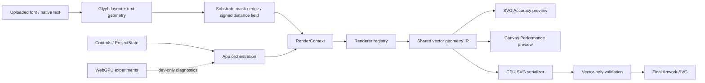

# SUBSTRATE Architecture Overview

> Auditor-facing snapshot of the current workspace as of 2026-06-30.
>
> The repository currently contains uncommitted work through Gate 7.9. This
> document describes the code that is present in the working tree, not only the
> last committed revision.

## 1. Product summary

SUBSTRATE is a browser-based generative typography application. A user enters
text, selects a renderer/preset, adjusts field and typography parameters,
previews the result, and exports deterministic vector SVG.

The core product requirement is:

- interactive editing may use a presentation-optimized preview;
- Final Artwork export must remain deterministic, fixed-bounds, CPU-generated,
  vector-only SVG;
- preview backends must never become export backends.

The default preset is **Edge Current**, which renders an animated Flow Lines
field clipped to the text substrate.

Current product scale:

- 17 named presets plus Custom;
- 9 renderer implementations;
- project schema version 7;
- fixed 1200 × 720 artboard;
- Final Artwork and Editable Text SVG export modes;
- native browser text fallback plus uploaded OpenType outline support;
- Canvas Performance and SVG Accuracy preview modes for Flow Lines.

## 2. Technology and libraries

### Runtime

| Library/platform | Version | Purpose |
| --- | --- | --- |
| React | 19 | Application UI and declarative SVG preview |
| React DOM | 19 | Browser rendering |
| TypeScript | ~5.7 | Application and rendering-engine implementation |
| opentype.js | 2.x | Uploaded font parsing and glyph outline extraction |
| Browser Canvas 2D | native | High-performance Flow Lines editing preview |
| SVG DOM | native | Accuracy/reference preview and vector export format |
| Web Workers / OffscreenCanvas | native, optional | Substrate computation off the main thread |
| WebGPU | native, optional/dev-only | Experimental field/texture diagnostics and benchmarks |

### Tooling and tests

| Library | Version | Purpose |
| --- | --- | --- |
| Vite | 6 | Development server and production bundling |
| `@vitejs/plugin-react` | 4 | React/Vite integration |
| Vitest | 4 | Unit, integration, DOM, renderer, and vector-integrity tests |
| jsdom | 29 | React/component test environment |
| `@napi-rs/canvas` | 1 | Native canvas support for selected tests |

There is no router, server framework, database, API client, global-state
library, component library, CSS framework, animation library, or runtime schema
library. Styling is one custom CSS file. State is held in React and plain
TypeScript modules.

Build commands:

```text
npm run dev
npm run build
npm run lint       # currently TypeScript noEmit, not ESLint
npm test
```

The latest Gate 7.9 validation passed 38 test files / 418 tests. The production
bundle transformed 102 modules and produced an approximately 620 kB minified
main JavaScript chunk (approximately 183 kB gzip). Vite reports the existing
500 kB chunk-size advisory.

## 3. High-level architecture



The central architectural boundary is the geometry intermediate representation
in `src/engine/geometry.ts`. Renderers generate plain vector primitives:

- line segment;
- circle;
- polyline;
- arbitrary SVG path.

Preview surfaces and export consume those primitives differently. Renderer math
is not embedded in React components or the SVG serializer.

## 4. Main application orchestration

`src/App.tsx` is the composition root and currently owns most runtime
orchestration:

- serialized `ProjectState`;
- runtime-only `PreviewSettings`;
- play/pause and export state;
- uploaded font state;
- typography/glyph layout;
- substrate build input and backend status;
- emitter and composite wave-field resolution;
- renderer context and geometry generation;
- export estimates and warnings;
- preview backend selection;
- Canvas diagnostics;
- developer WebGPU and FPS overlays;
- project import and SVG download.

The component uses local React state, `useMemo`, `useEffect`, and `useCallback`.
There is no external store. `Controls` receives the current state and setter;
`Viewport` receives already-resolved geometry/context plus preview configuration.

This is straightforward at the dependency level, but `App.tsx` is a broad
orchestrator and is one of the main candidates for decomposition.

## 5. State and persistence

### Serialized artwork state

`ProjectState` in `src/types.ts` is the complete project/document model. It
includes:

- typography and alignment;
- renderer and seed;
- shared field controls;
- appearance;
- export mode and numeric precision;
- substrate quality;
- preset identity;
- single/multiple emitter configuration;
- diffuser, contour, overlay, erosion, warp, and glyph-modulation controls;
- debug settings;
- uploaded-font metadata.

`src/engine/projectSchema.ts` migrates schemas 1–7, validates enums and colors,
clamps numeric values, repairs emitter rows, and discards unknown properties.
The app does not use a schema-validation dependency.

### Runtime-only state

`PreviewSettings` contains:

- FPS cap;
- pause-when-hidden;
- reduced/static preview;
- preview backend;
- SVG preview quality.

It is intentionally absent from `ProjectState`. Preview backend and quality do
not serialize into `.substrate.json` and do not represent artwork semantics.

### Presets

`src/engine/presets.ts` stores presets as partial `ProjectState` patches.
Applying a preset merges that patch onto the current document. Changing a
field-level control marks the preset as Custom.

Preview recommendations are separate runtime metadata in
`src/engine/previewBackend.ts`. Edge Current recommends Canvas Performance.

## 6. Typography and substrate pipeline

### Typography

Two text paths are supported:

1. **Uploaded font:** `opentype.js` parses the font; glyph layout generates
   positioned outline paths and glyph metadata.
2. **Native fallback:** browser text metrics and SVG/Canvas text are used when
   no parsed outline font is loaded.

Typography includes tracking, kerning mode/strength, optional optical spacing,
alignment, and vertical offset. Glyph geometry also supplies emitter anchors
and optional outline-based masks.

### Substrate

The substrate is a raster analysis structure used by SDF/edge-aware renderers,
not the exported artwork itself. The pipeline:

1. rasterizes glyph outlines or native text into a mask;
2. builds an edge map;
3. builds an approximate signed distance field;
4. exposes mask, edge, distance, and gradient sampling.

Four resolution presets are available: Low, Medium, High, and Ultra.

### Substrate backends

The preferred compute backend is a module Web Worker. It performs capability
self-tests for Worker, OffscreenCanvas, Path2D, rasterization, and transferable
arrays. A CPU-main-thread backend is the fallback.

`LatestOnlyScheduler` coalesces rapid updates and ignores obsolete results.
`useSubstrateBackend` adds:

- a 50 ms enqueue delay;
- request identity and stale-result protection;
- backend fallback;
- detailed phase/capability/timing diagnostics;
- Strict Mode-aware delayed worker disposal.

This subsystem is robust, but its diagnostics and fallback taxonomy are
significantly more elaborate than the rest of the app.

## 7. Renderer engine

All renderers implement `VectorRenderer`:

```text
id
label
supported controls
SVG element type
usesTime
usesSubstrate
optional glyph-field behavior
preview clipping/overlay policy
generateGeometry(state, context)
estimateCost(state)
```

The registry currently contains:

- Flow Lines;
- Ripple Lines;
- Dot Field;
- SDF Flow;
- SDF Streamlines;
- SDF Contours;
- SDF Halftone;
- Wave Contours;
- Glyph Diffuser.

`RenderContext` carries animation time/frame, text geometry, substrate data,
composite glyph-emitter field samplers/diagnostics, and viewport bounds.

`rendererRuntime.ts` is the common execution layer. It:

- resolves the renderer from the registry;
- measures generation time;
- caches static renderer output with a 24-entry cache;
- never caches time-dependent renderers;
- constructs explicit geometry cache keys;
- excludes appearance-only colors/transparency from geometry identity;
- summarizes element, point, node, and byte estimates.

The renderer algorithms are custom TypeScript math. There is no scene graph,
graphics framework, shader dependency, or third-party geometry engine.

## 8. Field and emitter system

The field subsystem supports one or multiple glyph-anchored radial emitters.
Sources can resolve from the first, last, middle, counter-like, explicit, or
custom glyph location. Emitters have amplitude, frequency, phase, radius,
falloff, self/neighbor influence, weight, phase offset, and radius multiplier.

`buildCompositeWaveField` combines active emitters and exposes scalar and
gradient sampling. Renderers may use it directly or via glyph-field modulation.

This is shared by Wave Contours, sonic SDF variants, Glyph Diffuser, outline
warp, and related presets. It is product functionality rather than preview
infrastructure.

## 9. Preview architecture

### Backend contract

`src/engine/previewBackend.ts` defines two explicit presentation backends:

- `canvas-2d`: **Canvas Performance · preview only**;
- `svg-dom`: **SVG Accuracy · vector DOM**.

Canvas currently supports Flow Lines. Unsupported renderers visibly resolve to
SVG Accuracy. There is no silent automatic Canvas fallback.

### Canvas Performance

`CanvasFlowPreview` owns an imperative `requestAnimationFrame` loop with:

- accumulator-based FPS limiting;
- remainder carry;
- hidden-tab pausing;
- stale-backlog dropping;
- throttled diagnostics;
- deterministic cleanup on state/backend change and unmount.

It calls the same renderer runtime through `FlowPreviewFrame`. The frame contains
resolved line geometry, appearance, artboard bounds, text geometry, and time.

Canvas groups Flow segments into 24 opacity cohorts and issues at most 24
`stroke()` submissions per frame instead of approximately 1,564 individual
strokes. Glyph outlines use `Path2D` clipping; native fallback uses
`destination-in` text masking.

At target 60 FPS, the latest controlled in-app comparison measured:

| Backend | Edge Current observed FPS |
| --- | ---: |
| Canvas Performance | 60.1 |
| SVG Accuracy / Full | 34.4 |

Canvas is the initial and recommended Edge Current editing mode. It is not
claimed to be export-identical at the pixel level.

### SVG Accuracy

The SVG DOM preview:

- uses the same vector geometry;
- retains native SVG text/path masks;
- groups roughly 1,564 lines into stable opacity-bucket `<path>` elements;
- updates `d` attributes imperatively to avoid thousands of React-managed line
  nodes and per-segment attribute writes.

SVG quality modes currently map to coherent 24, 12, or 8 total opacity buckets.
All paths in a selected mode update together. Additional temporal, mask,
cadence, local-clock, and hybrid variants remain dev-only trace experiments.

Full animated SVG is limited primarily by masked SVG repaint and `d`
invalidation, not renderer JavaScript.

### Viewport navigation

Zoom and pan are owned by `CanvasNavigation`, outside document state and
renderer inputs. They apply a CSS transform to the preview wrapper and therefore
do not regenerate geometry or alter export.

## 10. SVG export architecture

`src/engine/exportSvg.ts` is independent of preview components/backends.

Final Artwork export:

1. receives `ProjectState`, `RenderContext`, text geometry, and optionally
   precomputed renderer geometry;
2. resolves full geometry through the CPU renderer when necessary;
3. serializes line/circle/polyline/path primitives;
4. builds glyph/native-text masks and optional overlay/erosion/warp structures;
5. embeds project and diagnostic metadata;
6. emits a fixed 1200 × 720 viewBox;
7. validates the finished document as vector-only.

The vector guard rejects:

- `<image>`;
- `<canvas>`;
- `<foreignObject>`;
- `data:image`;
- base64 payloads.

The exported artwork geometry is deterministic for a fixed state/context.
`exportTimestamp` metadata intentionally varies between exports.

Editable Text export emits browser text rather than generated marks. Final
Artwork emits renderer geometry and mask/overlay structures.

Preview backend, preview quality, Canvas, and WebGPU modules are not inputs to
the serializer.

## 11. WebGPU status

WebGPU is not a required product backend and is not connected to export.

The repository nevertheless contains a substantial experimental WebGPU area:

- capability/device abstractions;
- compute spike;
- CPU/GPU field parity validation;
- single, repeated, batched, and persistent benchmarks;
- texture-preview controller;
- pacing/presentation runner;
- application field adapter;
- device-loss/fallback handling;
- CSV/table/report helpers;
- a dev-only UI overlay.

This code is guarded as experimental/dev tooling. It is the clearest candidate
for being disproportionate to the current product because it has many contracts,
benchmark modes, diagnostics, and tests without being a shipping preview path.

## 12. Diagnostics and performance instrumentation

The app includes diagnostics for:

- renderer generation and geometry cache state;
- substrate worker/main-thread backend and request scheduling;
- SVG serialization cost and export budgets;
- preview timing validity and frame pacing;
- Canvas draw time and diagnostic cadence;
- SVG path grouping, writes, `d` size, and geometry rebuilds;
- App render counts;
- glyph/emitter/field behavior;
- debug substrate images;
- WebGPU support, parity, pacing, and benchmarks.

The instrumentation was useful for isolating the SVG repaint ceiling and
justifying the dual preview backend. However, it now spans several modules:

- `previewPerformanceMeter.ts`;
- `previewRuntimeDiagnostics.ts`;
- `previewTraceConfig.ts`;
- `PreviewPerformanceMeter.tsx`;
- numerous WebGPU diagnostic/benchmark files.

An audit should distinguish temporary investigation tooling from permanent
product architecture.

## 13. UI/component structure

Primary React components:

- `App`: orchestration and state;
- `Controls`: the entire control panel, preset editing, file/font inputs, preview
  mode, output, and debug controls;
- `Viewport`: SVG/canvas composition, mask/overlay rendering, and diagnostics;
- `CanvasFlowPreview`: imperative Flow Canvas backend;
- `FlowPreview`: grouped-path SVG Flow backend;
- `CanvasNavigation`: zoom/pan shell;
- dev-only WebGPU and FPS overlays.

There is no reusable component framework. The large `Controls` and `Viewport`
components mix product presentation with diagnostic presentation and are likely
maintenance hotspots.

## 14. Test strategy

The test suite covers:

- project migrations and validation;
- presets and control behavior;
- typography/glyph layout;
- substrate raster/edge/distance computation;
- worker backend fallback, scheduling, and diagnostics;
- every renderer family;
- deterministic geometry and quality invariants;
- Canvas loop ownership/cleanup;
- animation timing and scheduler behavior;
- SVG grouped-path behavior;
- preview backend and quality isolation;
- zoom/pan isolation;
- SVG serialization and compatibility;
- all named preset vector-integrity checks;
- forbidden raster payloads;
- WebGPU capability, mapping, parity, pacing, and benchmark helpers.

The suite is broad and strongly protects export integrity. On the current
Windows environment it is safer to run Vitest with limited worker concurrency;
unrestricted worker spawning has exhausted the paging file.

## 15. Current strengths

- Very small third-party runtime dependency surface.
- Renderer math is separated from React and serialization.
- Shared vector geometry is a useful, understandable boundary.
- Export isolation is explicit and extensively tested.
- Project migrations and deterministic output are treated seriously.
- Canvas solves the dense animated editing problem without weakening SVG export.
- Appearance and viewport-only changes are intentionally excluded from geometry.
- Optional Worker/WebGPU capabilities have fallbacks and do not become product
  requirements.

## 16. Likely complexity and overengineering risks

### High-confidence risks

1. **WebGPU experiment surface**
   - Many large modules and tests exist for a backend that is not shipping.
   - Benchmarks, parity diagnostics, texture preview, pacing suites, adapters,
     and fallbacks may be better isolated into an experimental package/branch.

2. **Permanent retention of investigation tooling**
   - Gates 7.8A–D added trace variants and detailed runtime counters.
   - Much of this could be removed or gated behind a dedicated diagnostics
     build once the dual backend is accepted.

3. **Broad composition root**
   - `App.tsx` coordinates typography, substrate, emitters, renderer geometry,
     preview timing, import/export, diagnostics, and dev tools.
   - The code is not dependency-heavy, but responsibility density is high.

4. **Large UI components**
   - `Controls` and `Viewport` know about most product modes and diagnostics.
   - Adding renderers or controls increases conditional logic in central files.

5. **Parallel backend tax**
   - SVG and Canvas must remain behaviorally aligned.
   - The shared geometry contract limits divergence, but masks/typography and
     paint composition still have backend-specific implementations.

### Medium-confidence risks

6. **Hand-written cache keys**
   - Renderer cache identity is carefully curated but easy to make stale when
     new geometry-affecting state fields are added.

7. **Large flat `ProjectState`**
   - It is explicit and migration-friendly, but renderer-specific settings live
     beside global settings and require broad validation/control-awareness code.

8. **Diagnostic taxonomy depth**
   - Worker support/failure types and preview timing states are precise, but may
     exceed what a single-user creative tool needs operationally.

9. **Export metadata size**
   - The complete project is embedded in SVG metadata, increasing output size
     and coupling project schema to every exported SVG.

10. **“Lint” is only typechecking**
    - There is no ESLint/static rule layer despite complex hooks, effects,
      workers, and resource lifecycles.

### Complexity that appears justified

- separate preview and export paths;
- vector geometry IR;
- renderer registry;
- project migrations;
- font-outline and native-text fallback;
- Worker fallback for expensive substrate computation;
- vector-only export validation;
- deterministic preset integrity tests.

## 17. Suggested audit questions

For an external architecture audit, focus on:

1. Which WebGPU files should be removed, moved to an experiment package, or
   retained?
2. Which Gate 7.8 diagnostics are still worth shipping in development builds?
3. Should `App` be split into hooks/services now, or is the current explicit
   composition root preferable for this app size?
4. Should `ProjectState` remain flat or be grouped into typography, appearance,
   field, emitter, and renderer-specific sections in a future schema?
5. Is the Worker substrate backend earning its lifecycle/fallback complexity?
6. Can Canvas and SVG share more mask/paint logic without creating an artificial
   abstraction?
7. Should static renderer caching use declarative renderer-owned dependency keys
   instead of one central manually maintained key?
8. Is embedding the entire project in every SVG valuable enough to justify its
   size and coupling?
9. Which tests protect real product invariants versus experimental machinery?
10. What is the smallest architecture that preserves:
    - responsive editing;
    - deterministic vector export;
    - uploaded-font support;
    - all current presets;
    - project compatibility?

## 18. Concise assessment for the auditor

The app is not overengineered in terms of external frameworks or abstraction
fashion: most of it is direct TypeScript implementing genuinely specialized
graphics behavior. The likely overengineering is concentrated in diagnostics
and experimental GPU infrastructure, not in the core renderer/export model.

The core architecture can be summarized as:

```text
ProjectState + typography + substrate
    → renderer registry
    → shared vector geometry
    → Canvas/SVG preview OR isolated CPU SVG export
```

That core is relatively clean. The audit should primarily determine how much
experimental/performance infrastructure can be deleted or quarantined without
weakening that path.
