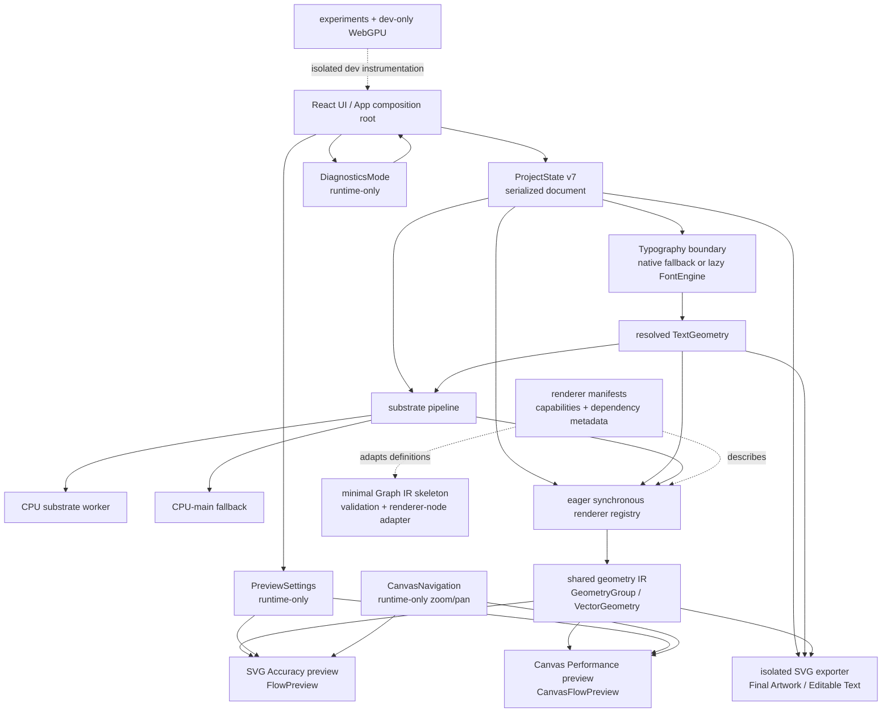

# SUBSTRATE architecture overview after refactor/performance passes

Audit snapshot: 2026-07-01  
Repository version: `0.20.0`  
Source snapshot: initially dirty; provenance was resolved by the commit pass described below.

## 1. Product summary

SUBSTRATE is a browser-based generative typography tool. It turns text, typography settings, deterministic seeds, scalar fields, glyph emitters, and renderer-specific controls into an interactive visual preview and exportable SVG artwork.

The primary user story is: configure type and a field-driven renderer, inspect and animate the result, then save the project or export an SVG. A user can work with browser-native text or upload a `.ttf`/`.otf` file to obtain parsed glyph outlines.

The core product contract is deliberately asymmetric:

- interactive preview may use reduced work, grouped geometry, frame caps, Canvas, or other optimizations;
- **Final Artwork SVG remains deterministic, vector-only, and CPU/generated** for a fixed project, resolved text geometry, render context, and exporter version;
- preview backends are presentation mechanisms and must not become export backends.

## 2. Current technical stack

Installed versions in this working tree:

| Area | Technology | Version/status |
| --- | --- | --- |
| UI | React / React DOM | 19.2.7 |
| Build/dev server | Vite | 6.4.3 |
| Language | TypeScript | 5.7.3 |
| Project import boundary | Valibot | 1.4.2; validates unknown JSON before migration/repair |
| Font parsing | `opentype.js` | 2.0.0; dynamically imported only through `loadFontEngine()` |
| Worker experiment | Comlink | 4.4.2 dev dependency; isolated spike, not production runtime |
| GPU experiment | WebGPU | dev-only diagnostics/prototypes; not an authoritative renderer or exporter |
| Unit/integration tests | Vitest + jsdom | Vitest 4.1.9 |
| Lint | ESLint | 10.6.0 |
| Bundle analysis | Rollup visualizer | 7.0.1, enabled by `npm run analyze` |
| Canvas test support | `@napi-rs/canvas` | 1.0.1 |

Production substrate computation still uses the explicit worker protocol with a CPU-main fallback. Neither Comlink nor experiments are part of the production entry graph.

## 3. High-level architecture diagram



“Shared geometry IR” here means the implemented `GeometryGroup` and `VectorGeometry` contracts. It is distinct from the future-facing Graph IR and is not a separately versioned formal IR.

## 4. Main modules and ownership

### `App.tsx`

After hook extraction, `App.tsx` is still the main composition and orchestration root. It owns:

- assembly of document, font, substrate, renderer, animation, preview, diagnostics, navigation, and export flows;
- live versus static render-context selection;
- renderer geometry memoization and export geometry selection;
- font upload/clear and project import/export handlers;
- preview backend resolution, Canvas failure handling, and preview diagnostics;
- dev-only WebGPU and performance-overlay wiring;
- top-level controls, viewport, transport, status, and messages.

It no longer directly owns all underlying state and pipelines, but it remains large and contains product-policy decisions. `useRendererRuntime` exists as a focused hook, although the current `App.tsx` still invokes the lower-level renderer runtime directly for its live/export/estimate variants.

### Focused hooks

| Hook | Current ownership |
| --- | --- |
| `useProjectDocument` | Owns `ProjectState`, migration/repair import, and document serialization helper. |
| `useTypographyGeometry` | Memoizes parsed-font glyph layout and measures its build time. Native fallback yields no parsed outline geometry. |
| `useSubstratePipeline` | Converts document/text geometry into substrate input and delegates to the selected worker/main backend lifecycle. |
| `useRendererRuntime` | Computes a renderer geometry key and memoized geometry; present as a boundary, not yet the sole path used by `App`. |
| `usePreviewSettings` | Owns runtime-only FPS, hidden-tab, reduced-motion, backend, and quality settings. |
| `useExportController` | Owns the transient `exporting` flag. |
| `useDiagnosticsState` | Owns `off | compact | full` and derives visible/expanded flags. |

### Components

- `src/components/panels` contains focused control sections: artwork/typography, emitters, field controls, advanced field controls, diffuser/appearance, output, and the shared `PanelSection`.
- `CanvasNavigation` owns zoom/pan/FIT state and applies only a CSS transform around preview content.
- `Viewport` composes the artwork preview, masks/overlays, diagnostics, warnings, and backend-specific preview component.
- `FlowPreview` is the SVG Accuracy path for animated Flow geometry. It uses a stable grouped path pool rather than a React element per segment per frame.
- `CanvasFlowPreview` is the Canvas Performance path for Flow. It owns its draw loop, grouped drawing behavior, timing samples, clipping, and cleanup.

## 5. State model

`ProjectState` is the schema-v7 serialized artwork document. It contains text and font metadata; typography and layout; renderer and deterministic seed; field, contour, halftone, diffuser, emitter, overlay, erosion, and warp controls; export mode/frame/precision; appearance; substrate quality and node budget; preset identity; and legacy `debug`.

Runtime-only state includes:

- `PreviewSettings`;
- `DiagnosticsMode`;
- animation playing/clock state;
- loaded font object and raw uploaded bytes;
- substrate backend lifecycle/status;
- Canvas failure and timing samples;
- zoom/pan navigation;
- transient messages, exporting state, and dev-overlay state.

`PreviewSettings` are not serialized because FPS caps, pause behavior, reduced motion, preview quality, and Canvas/SVG choice affect editor presentation and machine workload, not artwork identity. Serializing them would make project files carry device/user preferences and could incorrectly imply export changes.

`DiagnosticsMode` is not serialized because diagnostic surface density is a user/runtime preference, not generated-artwork input.

`ProjectState.debug` remains serialized for schema-v7 lossless compatibility. It represents older persisted visual-aid switches and is distinct from `DiagnosticsMode`. Current repair fills missing debug keys, and current saves preserve the object. Removing it in v7 would cause round-trip data loss.

Schema v7 remains authoritative. A possible schema v8 should explicitly extract legacy debug preferences into versioned local/workspace runtime storage, define downgrade behavior, and migrate before dropping `ProjectState.debug`. It could also begin decomposing the large flat document, but such restructuring is planned, not implemented.

## 6. Font engine boundary

`loadFontEngine()` dynamically imports `opentypeFontEngine.ts`, caches a successful module promise, and clears a rejected promise so a later upload can retry. `opentypeFontEngine.ts` is the only product module that directly imports `opentype.js`.

Product code depends on local contracts:

- `ParsedFont`;
- `ParsedGlyph`;
- parsed path contracts;
- `FontEngine.parse(ArrayBuffer)`.

Without an uploaded font, SUBSTRATE uses native SVG/browser text behavior. Native fallback cannot provide the same glyph outlines, exact parsed kerning, or glyph metrics as a loaded font, so some layout/emitter behavior is approximate.

An uploaded supported font is parsed asynchronously, registered for browser display when possible, retained in runtime memory, and used to resolve deterministic glyph paths and layout. Raw font bytes are never written into `ProjectState`.

On project import, font metadata can identify the prior file, but metadata alone cannot reconstruct outlines. The loaded font is cleared and the user is told to re-upload the original file. Native fallback remains active until then.

SVG export never loads or invokes the font parser. It consumes already-resolved `TextGeometry`; if outlines are unavailable it honestly emits native SVG text behavior.

Bundle impact:

| Output | Before lazy boundary | Current (2026-07-01) |
| --- | ---: | ---: |
| Initial app JS | 627.92 kB / 185.07 kB gzip | 386.46 kB / 117.34 kB gzip |
| Lazy OpenType chunk | part of initial chunk | 243.12 kB / 68.16 kB gzip |

The “before” numbers are the recorded Pass 2 baseline. The current numbers come from the latest local analyze build.

## 7. Preview architecture

Preview has two explicit descriptors:

- `canvas-2d`: **Canvas Performance · preview only**;
- `svg-dom`: **SVG Accuracy · vector DOM**.

Selection is explicit and renderer-scoped. Canvas currently applies to Flow; other renderers resolve to SVG. If Canvas is unavailable or reports failure, the resolver returns SVG and diagnostics expose the fallback. There is no silent automatic switch from SVG Accuracy to Canvas.

Both previews consume renderer-produced geometry:

- Flow SVG groups all segments into a fixed path-bucket pool, preserves segment coverage, reuses DOM identity, and limits per-frame attribute writes;
- Canvas groups draw work imperatively in one owned rAF loop and reports draw/pacing samples.

`CanvasNavigation` keeps zoom/pan state internal. Wheel bursts accumulate against refs and commit at most once per `requestAnimationFrame`. The default transform is crisp 2D `translate(...) scale(...)`, allowing the browser to repaint SVG/Canvas content at the current scale. A dev-only `composited` instrumentation mode uses `translate3d`/layer promotion for comparison.

Zoom and pan modify only the preview wrapper transform. They do not mutate `ProjectState`, renderer geometry, substrate data, render context, or SVG export.

Browser-specific SVG repaint cost remains relevant: the crisp path improves visual sharpness but can make large SVG trees expensive during navigation.

## 8. SVG export architecture

`src/engine/exportSvg.ts` is the isolated exporter. Import-boundary tests prevent it from depending on preview components, WebGPU, runtime hooks, diagnostics surfaces, or experiments.

Final Artwork export serializes generated vector geometry, masks, resolved glyph paths or native-text fallback, appearance, optional overlays/warp/erosion, hidden source text, and metadata. Editable Text export emits an honest native SVG `<text>` artwork group instead of converting editable text to outlines.

Every generated SVG passes `assertVectorOnlySvg()`. The guard rejects:

- `<image>`;
- `<canvas>`;
- `<foreignObject>`;
- `data:image/`;
- base64 payload markers.

The golden fixture corpus currently contains six schema-v7 representative projects and expected summaries. Each summary records a canonical SHA-256, `viewBox`, vector/forbidden element counts, and data-image/base64 absence. Canonicalization removes only timestamp instability and insignificant inter-element whitespace; it does not round or reorder geometry.

Fixture updates are intentionally opt-in:

```sh
npm run update:export-fixtures
```

The update prints old/new hashes and counts. Review the project JSON, summary diff, and reason for each changed hash before committing; never regenerate merely to silence a failure.

Canvas, SVG DOM grouping, preview quality, and WebGPU do not serialize exports. Export uses the CPU renderer registry and already-resolved geometry. Any future graph or GPU path must reproduce the golden corpus before becoming authoritative.

## 9. Renderer system

There are nine synchronous vector renderers:

1. Flow Lines (`flow`)
2. Ripple Lines (`ripple`)
3. Dot Field (`dots`)
4. SDF Flow (`sdf-flow`)
5. SDF Streamlines (`sdf-streamlines`)
6. SDF Contours (`sdf-contours`)
7. SDF Halftone (`sdf-halftone`)
8. Wave Contours (`wave-contours`)
9. Glyph Diffuser (`glyph-diffuser`)

`src/engine/renderers/index.ts` eagerly imports and registers every `VectorRenderer`. The registry remains the runtime authority.

Parallel renderer manifests declare labels, capabilities, supported controls, and dependency groups. Tests enforce agreement with registry compatibility fields. Dependency keys cover time, substrate/text geometry, seed, typography/text, emitters/field, glyph modulation, contours, halftone, diffuser, and appearance policy.

Cache identity is implemented separately in `rendererRuntime.ts`; the manifest does not generate cache keys. Tests mutate representative dependency-group values to guard coverage. Appearance-only, preview-only, navigation, and runtime diagnostics state are excluded from geometry identity.

Time-dependent renderers bypass the static geometry cache. Static renderers use stable context/key identity. The recent render-context lifecycle fix prevents live `timeMs`/`frame` ticks from invalidating static estimate/export context identity.

The renderer-node adapter derives future Graph IR node definitions from manifests. It does not execute them. There is no async or lazy renderer registry; current bundle measurements do not justify introducing that contract.

## 10. Graph IR status

The implemented Graph IR is a minimal skeleton:

- graph, node, connection, socket, and node-definition types;
- socket directions and value kinds;
- structural validation for duplicate IDs, missing nodes/sockets, direction, kind compatibility, and output-node validity;
- `createRendererNodeDefinition()` as a renderer/manifest adapter.

It has no graph evaluator or execution scheduler. It is not serialized, not part of `ProjectState`, not exposed as UI, not a WebGPU/shader runtime, and not authoritative over preview or export.

The intended path is to prototype evaluation internally across substrate → field → renderer → appearance/output stages, then define determinism, cache semantics, migration, persistence, error handling, and golden-export parity before considering product UI.

## 11. Diagnostics and experiments

`DiagnosticsMode` supports:

- `off`: hide the current diagnostics surface;
- `compact`: show the concise operational view (default);
- `full`: show expanded timing, cache, substrate, renderer, backend, and control detail.

Preview/runtime diagnostics report clock state, estimated FPS, frame/draw timing validity, selected backend, geometry/substrate regeneration, worker fallback/status, and renderer-specific data. Legacy `ProjectState.debug` still independently controls older artwork-adjacent visual aids.

WebGPU is future/runtime research plus a dev-only field overlay and benchmark/prototype suite. It is not a production renderer, Graph runtime, preview authority, or exporter. Dev UI is dynamically imported behind `import.meta.env.DEV`.

The Comlink spike performs one transferable substrate build call. Adoption requires measured benefit while preserving transferables, latest-request/cancellation semantics, fallback diagnostics, capability detail, Strict Mode cleanup, worker termination, and buffer ownership. The existing worker protocol remains authoritative.

Import-boundary tests prohibit normal production modules from importing `src/experiments`. Current production builds contain no WebGPU dev overlay, Comlink, or experiments chunks.

## 12. Bundle and performance status

Latest `npm run analyze` output:

| Output | Minified | Gzip |
| --- | ---: | ---: |
| Initial application JS | 386.46 kB | 117.34 kB |
| Lazy OpenType font engine | 243.12 kB | 68.16 kB |
| Substrate worker | 5.97 kB | not reported |
| CSS | 15.70 kB | 3.78 kB |
| HTML | 0.47 kB | 0.31 kB |

The Vite 500 kB chunk warning does not remain.

Implemented performance/correctness fixes include:

- lazy loading of the OpenType engine;
- wheel-event/rAF coalescing for viewport navigation;
- crisp 2D transform as the navigation default, with compositing restricted to dev instrumentation;
- stable static render-context creation and explicit `selectEstimateContext`/`selectExportContext` helpers, backed by regression tests.

## 13. Test strategy

Current suite: **458 tests in 45 files**, all passing.

Coverage includes:

- schema validation, v3–v7 migration/repair, and compatibility;
- renderer determinism, budgets, controls, diagnostics, and vector serialization;
- Canvas/SVG preview selection, grouped preview behavior, animation, appearance, and timing;
- Final Artwork and Editable Text export;
- six-project golden export fixtures and canonical SVG summaries;
- Graph IR validation and renderer-node adaptation;
- renderer manifest parity, dependency coverage, and cache behavior;
- import boundaries for export, experiments, dev overlays, WebGPU, and Comlink;
- lazy font-engine boundary and native fallback;
- viewport navigation math, rAF coalescing, transform mode, and geometry invariants;
- static render-context lifecycle and identity stability;
- substrate worker/main fallback, scheduling, diagnostics, and lifecycle;
- WebGPU experiments and dev-only gating without making them production authority.

Known environment caveat: jsdom logs two `HTMLCanvasElement.getContext()` “Not implemented” messages during the passing run. Tests use mocks/fallbacks where required; these messages are not failures, but browser Canvas behavior still needs real-browser QA.

## 14. Current strengths

- The deterministic vector export contract is isolated, guarded, and protected by integration fixtures.
- Preview performance policy is explicitly separated from export policy.
- Font parsing is behind a small lazy local contract, materially reducing initial transfer.
- Worker failure and CPU-main fallback are explicit and tested.
- Renderers share a small geometry model and have manifests without prematurely replacing the registry.
- Cache identity and static context lifecycle have targeted regression coverage.
- Runtime-only preview/diagnostic state is separated from serialized artwork state.
- Graph IR is introduced behind clear non-goals instead of being prematurely wired into the product.
- Experiments, WebGPU, and Comlink have enforced import boundaries.
- Navigation optimization preserves geometry/export invariants.
- Lint, typecheck, tests, production build, and analyze build are green.

## 15. Remaining architectural risks

### Commit provenance

At the start of the architecture audit, the working tree contained:

- modified `package.json` and `package-lock.json`;
- untracked `docs/EXPORT_FIXTURE_STRATEGY.md`;
- untracked `scripts/`;
- untracked `tests/exportGolden.test.ts`;
- untracked `tests/fixtures/export-summaries/`;
- untracked `tests/fixtures/projects/`;
- untracked `tests/utils/`.

Those golden-fixture, tooling, and strategy files were reviewed as one
test-only change and committed as `2b3dda2` (`test(export): add deterministic
golden SVG corpus`). This architecture overview is the separate documentation
change produced by the same provenance pass. The earlier implementation passes
already existed as distinct commits from `3174879` through `6f99f77`; the
provenance pass did not replay, squash, or alter them.

### Structural and product risks

- `App.tsx` remains a large composition root with orchestration, policy, event handlers, diagnostics, and dev wiring.
- `ProjectState` is still large and flat. Cross-cutting changes can create wide cache/migration/test impact.
- The renderer registry is eager and synchronous. This is currently justified, but it limits independent loading and plugin-style extension.
- Graph IR has no execution semantics, persistence, migrations, evaluator caching, or parity proof.
- WebGPU future scope needs governance: which workloads may use it, how fallback works, and which contracts can never become GPU-dependent.
- Native fallback has weaker glyph metrics, outline, kerning, and emitter-anchor fidelity than parsed fonts.
- Legacy `ProjectState.debug` blurs artwork-document and workspace-preference ownership.
- Diagnostics are split between legacy debug flags, runtime `DiagnosticsMode`, preview measurements, and dev overlays; this can increase UI and reasoning complexity.
- Crisp SVG navigation can trigger expensive browser-specific repaint behavior on large DOM trees.
- `useRendererRuntime` is not yet the single renderer-runtime path, leaving duplicated orchestration in `App`.

## 16. Recommended next passes

1. **Commit/squash and provenance pass.** Separate boundary/refactor changes, golden-corpus additions, and this audit snapshot into reviewable commits or a clearly documented squash. Risk: careless squashing can hide why canonical hashes or dependency versions changed.
2. **Internal Graph Evaluation Prototype.** Evaluate a small non-serialized graph against one or two existing renderers and require golden-export parity. Keep it out of UI and saved projects. Risk: premature generalization can duplicate the current runtime and destabilize cache semantics.
3. **Font engine alternatives spike.** Measure parser size, parse latency, glyph/path fidelity, kerning, licensing, browser support, and failure behavior against the current local contract. Risk: smaller engines may regress typography fidelity or expand compatibility burden.
4. **Debug ownership and schema-v8 planning.** Define extraction of legacy debug values, local preference persistence, v7 import, v8 save, downgrade behavior, and document decomposition. Risk: data loss or surprising visual changes without explicit migration tests.
5. **UX/interaction quality pass.** Simplify diagnostics/control density and separately profile SVG preview zoom/pan in target browsers. Risk: hiding advanced controls can reduce debuggability; compositing changes can trade repaint cost for blur.

## 17. Verification

Verification run on 2026-07-01 before commit grouping, followed by the same
full gate after grouping:

| Check | Result |
| --- | --- |
| `npm run lint` | Pass |
| `npm run typecheck` | Pass |
| `npm run test` | Pass: 458 tests / 45 files |
| `npm run build` | Pass: Vite 6.4.3, 115 modules transformed |
| `npm run analyze` | Pass; sizes recorded in section 12; no 500 kB warning |
| Browser QA | Not run as part of this documentation-only audit |

The first sandboxed test/build/analyze attempt was blocked by filesystem access while esbuild loaded `vite.config.ts`; the same RTK-wrapped verification was rerun with the required permission and passed. No product code, dependencies, or fixtures were changed by this documentation pass.
