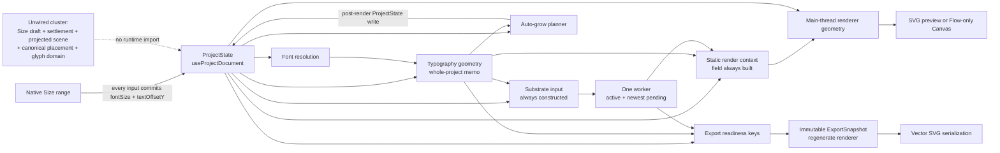
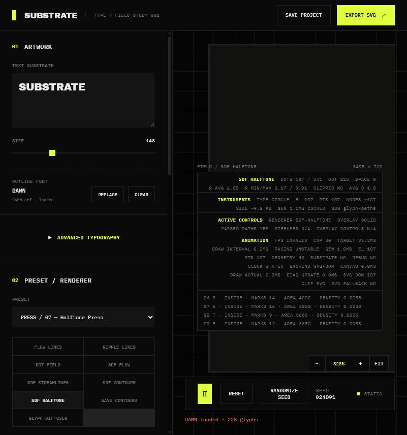
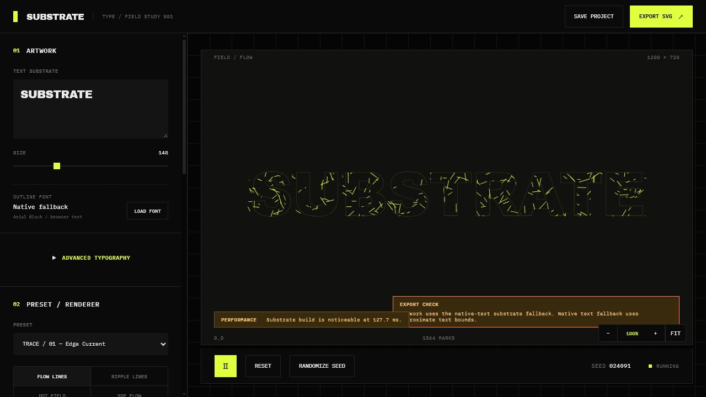
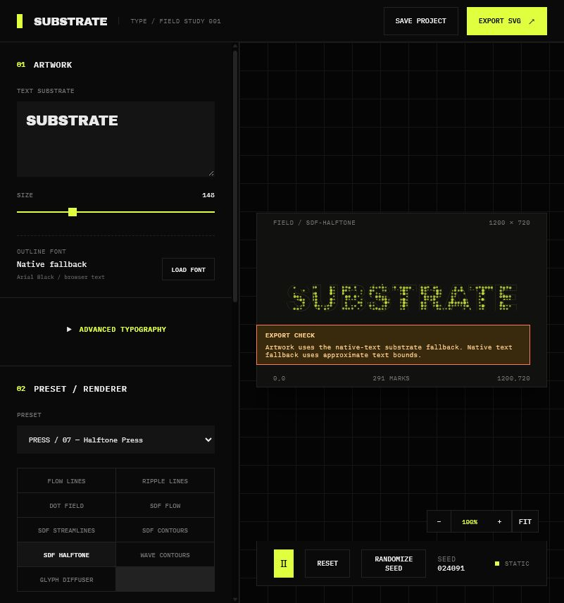
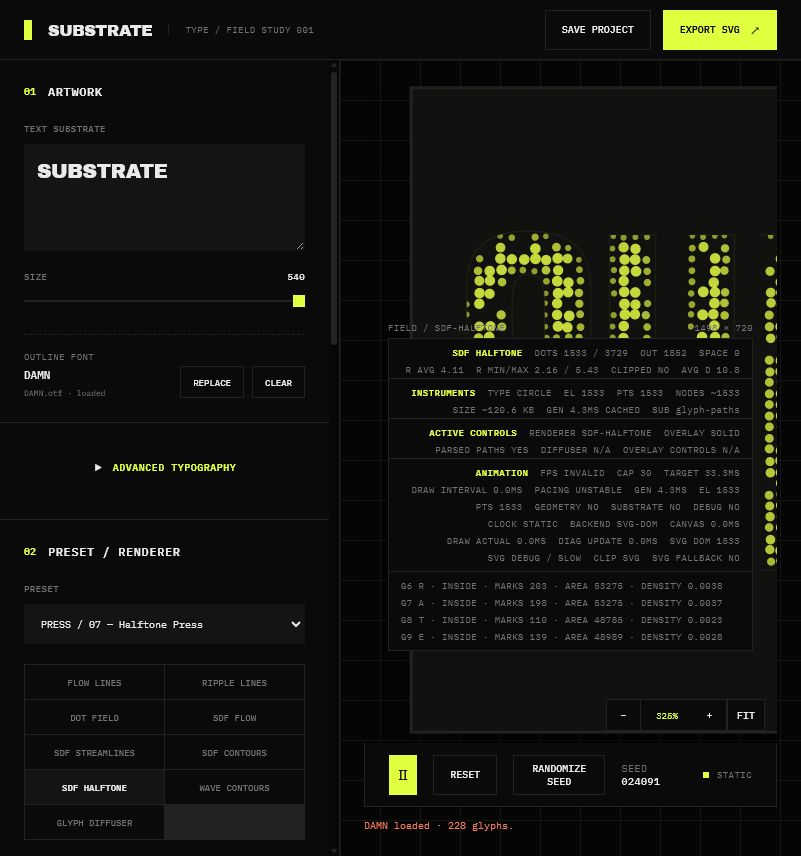
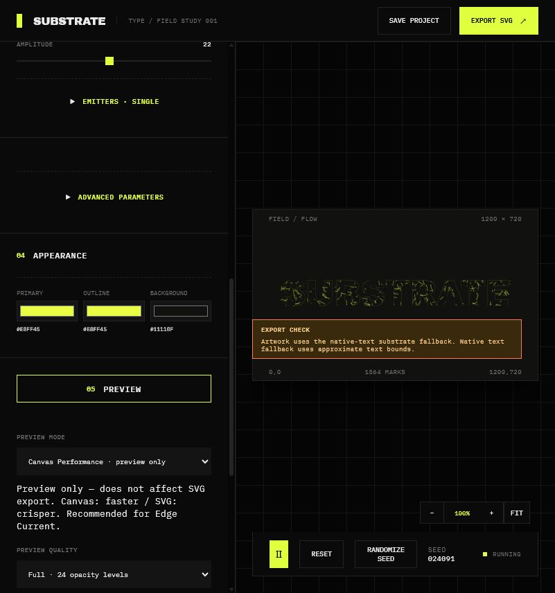

# SUBSTRATE architecture and performance audit — pass 2

**Audit date:** 2026-07-12  
**Audited revision:** `041966c` (`master`)  
**Scope:** repository architecture, production/runtime wiring, focused and full test runs, typecheck/lint/build/analyze output, and manual in-app-browser probes.  
**Change policy:** no product code was changed. The only audit outputs are this report and the screenshots under `docs/architecture-performance-audit-2/`.

## 1. Blunt verdict

**SUBSTRATE is not stable enough to grow. Freeze feature work and simplify the core interaction/scene model first.**

The previous pass produced real improvements: stale substrate cannot unlock export, latest-only worker identities are substantially safer, catastrophic raster/Canvas allocations are capped deterministically, dense occupancy is bounded, and candidate generation is usually bounded before materialization. Those foundations should stay.

But the current revision tells two incompatible stories:

- The shipped product still uses a controlled native range that commits `ProjectState` on every Size input (`ArtworkTypographyPanels.tsx:43,103-107`), legacy fixed-baseline placement (`textLayout.ts:41`; `constants.ts:15`), and post-render artboard repair that writes a larger artboard and adjusted offset back into the document (`useAutoGrowArtboard.ts:64,87`; `artboardExpansion.ts:98-104`).
- A large newer architecture—Size draft/settlement, renderer-aware draft preview, canonical placement, projected scene presentation, glyph domains, and tests for a shrinkable full-rect effective artboard—exists in source and tests but is not connected to `App` or `Viewport`. A source import scan finds no runtime root for that cluster.
- The full suite has **55 failures out of 677 tests** in exactly the six files that assert that newer model. A focused rerun reproduced **55 failures / 24 passes** across those six files. `resolveSceneLayout`, `resolveEffectiveArtboard`, and the tested `SizeRange` are absent or unexported; placement assertions miss center by up to 242 px.
- Manual browser evidence agrees with the failing tests. After a real Size 540 → double-click reset to 148, the preset and uploaded font survived, but the preview/export artboard remained **1498×720** instead of shrinking to the authored **1200×720**.

This is not primarily a tuning problem. It is an authority problem: runtime code, new abstractions, tests, and product claims disagree about which scene model exists. Adding renderers, node systems, font workflows, or collaboration now would make that disagreement more expensive to remove.

**Release gate:** one scene/placement authority, one truthful Size lifecycle, a green suite that compiles the tests it runs, and eight real-browser continuity gates.

## 2. Previous-audit findings: resolved / partial / unresolved

| Previous risk | Classification | Confirmed evidence | Remaining boundary |
|---|---|---|---|
| Stale export inputs | **Resolved** | `resolveExportReadiness` rejects missing typography, mismatched substrate, and mismatched renderer keys (`src/engine/exportAuthority.ts:139-152`). `captureExportSnapshot` clones the document and regenerates geometry from captured inputs (`:157-192`). Focused export tests pass. | `rendererGeometryKey` is asserted synthetically in `App` because generation is synchronous (`src/App.tsx:224-227`); the name overstates what is actually tracked. |
| Worker result revision safety | **Resolved for correctness; partial for wasted work** | `LatestOnlyScheduler` keeps one active and one pending request (`src/engine/substrate/backends/latestOnlyScheduler.ts:18-20,31-38`), rejects stale completion, and worker outputs carry request identity. Typed mask/edge/distance buffers are transferred (`src/engine/substrate/substrate.worker.ts:84-89`). | Active work is not cancelled. A stale expensive job must finish before the newest pending job starts (`latestOnlyScheduler.ts:56-73`). |
| Deterministic export snapshot | **Partially resolved** | Captured state/resources are immutable and geometry is rebuilt authoritatively (`exportAuthority.ts:175-192`). | Serialized SVG bytes are not deterministic because metadata embeds `new Date().toISOString()` (`src/engine/exportSvg.ts:66`), even when geometry is deterministic. |
| Extreme raster allocation | **Resolved** | Device-independent substrate caps are 1,048,576 cells, 4096 per axis, ~16 MiB resident and ~40 MiB planned peak (`src/engine/safetyBudget.ts:2-7,22-26`). Focused safety tests pass. | Keep the planner as the only allocation entrance. Direct callers still need coverage. |
| Canvas backing-store allocation | **Resolved for allocation; moved to presentation quality** | Backing size derives from CSS dimensions × DPR and is capped at 4,194,304 pixels / 4096 per axis (`safetyBudget.ts:29-33`; `CanvasFlowPreview.tsx:64-70`). | Canvas has no `ResizeObserver`/camera dependency. At browser zoom 244%, CSS grew to ~1003×600 while backing attributes stayed 411×245, so allocation is safe but output is upscaled/blurry. |
| Dense occupancy | **Resolved** | `planDenseOccupancy` coarsens until allocation is ≤2 MiB (`safetyBudget.ts:35-48`); SDF Streamlines consumes a point budget during generation (`sdfStreamlinesRenderer.ts:192,222`). | Its occupancy coordinate math assumes a zero-origin world (`sdfStreamlinesRenderer.ts:19-20`). |
| Contour work | **Partially resolved** | Raster cell×level scans are capped at 10,000,000 (`safetyBudget.ts:50-56`). | SDF Contours still extracts and stitches every permitted fragment before `maxNodes` is applied (`sdfContoursRenderer.ts:268,303`). Wave Contours stitches a full level before it can stop (`waveContoursRenderer.ts:184-196`). `maxNodes` remains output-only for materialization within the global scan cap. |
| Candidate materialization | **Resolved for the named dense emitters** | Halftone and Glyph Diffuser compute a stride before candidate materialization (`sdfHalftoneRenderer.ts:78-80,108-110`; `glyphDiffuserRenderer.ts:108-113,150-151`). | Glyph Diffuser then filters/sorts the accepted pool once per emitter (`glyphDiffuserRenderer.ts:253-259`), which can become emitter×candidate work. |
| Diagnostics cost | **Partially resolved** | Shared vector and raster budgets exist (`safetyBudget.ts:6,58`). | Full Viewport diagnostics flatten every rendered origin and then compute per-glyph sampling (`src/components/Viewport.tsx:53-62`); diagnostic geometry is also rendered with per-item maps (`:245`). The expensive path is not globally capped or isolated from React. |
| Broad state invalidation | **Still present** | Typography memoizes on the whole `ProjectState` (`src/hooks/useTypographyGeometry.ts:7-10`). Substrate input memoizes on `[project, textGeometry]` (`useSubstratePipeline.ts:13-45`) and is called unconditionally (`App.tsx:168`) even though Flow/Ripple declare `usesSubstrate:false` (`rendererManifest.ts:53-67`). Static context also depends on whole state and always builds a composite field (`App.tsx:177-187`; `renderContextLifecycle.ts:9-21`). | Focused export keys are better than runtime memo boundaries; key correctness has not been propagated to work scheduling. |
| Auto-grow document mutation | **Still present; claimed fix is absent** | `App` always enables `mode:"auto-grow"` (`App.tsx:198-202`). The hook calls `updateProject(latestPlan.nextState)` (`useAutoGrowArtboard.ts:64,87`). The plan persists larger `artboard` dimensions and changes `textOffsetY` (`artboardExpansion.ts:98-104`). | There is no full-rect effective artboard in production. Growth is one-way; browser reset remained 1498×720 at Size 148. |
| Device-dependent authoritative quality | **Resolved** | Safety limits are explicit and device-independent (`safetyBudget.ts:1-7`); export regenerates vector geometry and Canvas stays preview-only. | Preserve this contract while adding draft/preview budgets; never feed DPR or hardware class into Final Artwork identity. |

The focused “known-good foundations” run passed **43/43 tests** across `exportAuthority`, `safetyBudget`, `substrateBackends`, `invalidationKeys`, and `autoGrowArtboardRuntime`. That result is useful but narrow: `autoGrowArtboardRuntime` validates the current mutating design, not the claimed authored/effective design.

## 3. Current architecture map

### 3.1 What actually runs

### 3.2 Boundary-state ownership

| Boundary state | Owner / source | Persisted? | Identity | Invalidated by | Export? | Preview? |
|---|---|---:|---|---|---:|---:|
| `ProjectState` | `useProjectDocument` (`src/hooks/useProjectDocument.ts:10-17`) | Yes, JSON | `documentKey`, which removes only `debug` (`exportAuthority.ts:42-48`) | Every control commit/import/preset/auto-grow | Yes | Yes |
| Artboard | `ProjectState.artboard` | Yes | `{width,height}` only (`src/types.ts:94-96`) | User/import and auto-grow write | Yes | Yes |
| Effective artboard | **No production owner** | No | **No production key** | N/A | Absent | Absent |
| Loaded font resource | `App` + font loader | File itself no; metadata yes | metadata + fingerprint (`exportAuthority.ts:50-62`) | Upload/clear/import mismatch | Yes | Yes |
| Typography input | `App` key builder | No | focused typography key (`exportAuthority.ts:64-79`) | typography/artboard/font fields | Yes | Yes |
| Typography geometry | `useTypographyGeometry` | No | output key mirrors input (`exportAuthority.ts:82-85`) | In practice any `ProjectState` object change (`useTypographyGeometry.ts:10`) | Yes | Yes |
| Typography placement | `getTextLayout` + glyph layout | No | folded into typography input | Size, offsets, layout fields | Yes | Yes |
| Substrate request/result | `useSubstratePipeline` + backend/worker | No | `substrateBuildInputKey` (`exportAuthority.ts:87-105`) | In practice any project/text-geometry identity change | Renderer-dependent | Renderer-dependent, but work is unconditional |
| Field context | `createStaticRenderContext` | No | no independent public key | whole state, text geometry, substrate result | Renderer-dependent | Yes |
| Renderer geometry | `useRendererRuntime` | No | `rendererGeometryStateKey` + context (`useRendererRuntime.ts:20-46`) | geometry key/live context/static context | Yes | Yes |
| Export readiness | `App` + `resolveExportReadiness` | No | typography/substrate/renderer keys | authoritative stage identities | Gate only | HUD only |
| `ExportSnapshot` | click handler / `captureExportSnapshot` | No, ephemeral | captured document/resource/stage keys | new export action | Authority | No |
| Size draft/phase/settlement | `useTypographySizeDraft` | No | interaction id, settlement token, 8 authoritative key fields | **Unwired** | Intended gate | Intended preview |
| Preview backend/settings | `App` runtime state | No | preference + renderer capability | user mode / Canvas failure | No | Yes |
| Camera/FIT/DPR | `CanvasNavigation`, DOM, browser | No | runtime transform | zoom/pan/resize/DPR | No | Yes |
| Diagnostics mode | `App` runtime state plus persisted `state.debug` flags | Mixed | not in document export key for `debug` | HUD mode/debug toggles | No | Yes |

### 3.3 Duplicate authorities and mixed responsibilities

1. **Scene authority:** tests expect `resolveSceneLayout` and a shrinkable `{x,y,width,height}` effective rect; production has only persisted `{width,height}` and an auto-grow document mutation.
2. **Typography authority:** production uses fixed `TEXT_LAYOUT.baselineY = 405`; the new `canonicalFirstBaseline` helper is unused (`typographyPlacement.ts:21-40`).
3. **Size authority:** the shipped range owns Size through immediate document commits; the 351-line draft hook independently defines an idle/dragging/waiting lifecycle but has no caller.
4. **Flow preview authority:** `useRendererRuntime` generates live Flow geometry (`useRendererRuntime.ts:21-30`) while `CanvasFlowPreview` independently calls `createFlowPreviewFrame`, which generates geometry again (`flowPreviewFrame.ts:54-64`).
5. **Renderer readiness:** `App` marks renderer geometry current by equating keys when synchronous prerequisites match rather than tracking a renderer result (`App.tsx:224-227`). Correct today, misleading as a boundary.
6. **Preview-mode promise:** “Canvas Performance” is a global user choice, but `selectPreviewBackend` returns Canvas only when `renderer === "flow"`; every other renderer silently becomes SVG (`previewBackend.ts:35-42`).
7. **Diagnostics boundary:** display mode is runtime-only, but granular `state.debug` remains inside `ProjectState`, so diagnostic toggles can churn typography, substrate input, static context, and renderer context even though export identity drops `debug`.

## 4. Highest-risk correctness issues

### P0 — The checked-in architecture is self-contradictory

Confirmed: six new architecture test files fail **55 tests**. `effectiveArtboard.test.ts` imports nonexistent `resolveEffectiveArtboard` and `resolveSceneLayout` (`tests/effectiveArtboard.test.ts:2-3`); `sizeRangeInteraction.test.ts` imports an unexported `SizeRange` (`tests/sizeRangeInteraction.test.ts:4`); Canvas/glyph tests call the nonexistent scene resolver (`tests/canvasGlyphMapping.test.ts:33,109,143`). Typecheck still passes because `tsconfig.app.json` includes only `src` (`:20`).

Impact: contributors cannot know whether to preserve shipped behavior or the intended tests. This is more dangerous than an ordinary red suite because the red tests describe product contracts that the repository documentation claims are implemented.

### P0 — Auto-grow still mutates authored state and cannot shrink

Confirmed in code and browser. The plan only takes `Math.max` against current dimensions (`artboardExpansion.ts:86-91`) and writes the result into the project (`:98-104`). The stable post-reset screenshot shows Size 148 with a 1498×720 artboard.

Impact: a transient large Size permanently changes project/export dimensions and can alter `textOffsetY`; a 148 → 540 → 148 round trip is not identity-preserving.

### P0 — Raw Size input performs authoritative work

Confirmed: the range `onChange` calls `patch(centerPreservingTypographySizePatch(...))` (`ArtworkTypographyPanels.tsx:43`) for every native change (`:107`). That changes both `fontSize` and `textOffsetY` (`textLayout.ts:101-121`), invalidating whole-project typography, unconditional substrate input, field context, renderer geometry, auto-grow, preview, and export readiness.

Impact: the central interaction contract—runtime-only draft, one release commit—is not implemented at all.

### P1 — Placement is not canonically centered and Size rewrites authored displacement

Confirmed: first baseline is `405 + textOffsetY - lineSpan/2`, independent of artboard center and ink/layout center (`textLayout.ts:41`). Tests measure center Y 344.32 at Size 148, 183.6 at 540, and 118 at 700 versus a required 360. `centerPreservingTypographySizePatch` compensates by mutating `textOffsetY`; it preserves the previous visual center, not an authored delta from canonical center.

Impact: parsed/native, draft/final, and round-trip behavior cannot share a stable semantic rule until one placement authority replaces both helpers.

### P1 — Non-zero artboard origins are not propagated

Confirmed: `artboardBounds` always returns x/y zero and center is width/2,height/2 (`src/engine/artboard.ts:12-21`); Viewport passes a zero-origin rect to Canvas and uses a zero-origin SVG viewBox (`Viewport.tsx:146-157`); export serializes `viewBox="0 0 ..."` (`exportSvg.ts:138`). SDF Flow/Halftone/Streamlines and Glyph Diffuser clamp domains to `0..width`/`0..height` (`sdfFlowRenderer.ts:46-49`; `sdfHalftoneRenderer.ts:71-74`; `sdfStreamlinesRenderer.ts:173-176`; `glyphDiffuserRenderer.ts:101-104`). Diagnostics do the same (`rendererSampling.ts:28-38`).

Impact: the claimed full-rect effective-artboard contract cannot be made true by fixing only Canvas. It is a cross-cutting scene-coordinate migration.

### P1 — Export geometry is deterministic, exported bytes are not

Confirmed: timestamp metadata is generated on each export (`exportSvg.ts:66`). Geometry and project input may be identical while SVG bytes/hashes differ.

Impact: undermines deterministic fixture hashes, reproducible builds, and provenance. Either remove the timestamp from authoritative bytes or explicitly define canonicalization as the product contract.

### P1 — Canvas can clear a valid frame before a replacement exists

Confirmed in code: the effect resets `canvas.width/height` (`CanvasFlowPreview.tsx:69-70`), schedules an rAF (`:189-191`), and every draw clears before rendering (`:97`). The first tick initializes timing before a later draw. The effect depends on full `state` and `textGeometry` (`:193`), so Size/preset changes recreate this sequence.

Impact: a blank frame is structurally possible even if geometry generation is fast. Screenshot captures alone cannot prove a one-frame flash, so this requires a consecutive-frame pixel probe.

## 5. Highest-cost performance paths, evidence, methodology, and budgets

### 5.1 What was actually measured

These browser values are behavioral probes, not statistically valid benchmarks. Browser-control action time includes automation overhead, and the current app does not expose React Profiler commits, worker queue/transfer spans, empty-frame counters, or memory overlap. I therefore do not present click-wall-time as render time.

1. **Initial Edge Current / Flow:** the UI reported `Substrate build is noticeable at 127.7 ms` even though Flow declares `usesSubstrate:false`. This directly corroborates unconditional substrate scheduling.

   

2. **SDF Halftone settled:** native fallback rendered 291 marks at Size 148. With an uploaded parsed font at Size 540, Full diagnostics showed ~1533 SVG elements/points and renderer generation around 4.3 ms; that number excludes React commit, layout, and paint.

   

3. **Diagnostics Off → Full:** the automation-inclusive action completed in ~386 ms on the parsed-font, ~1533-mark scene. Source inspection shows an unbounded mark-origin flatten followed by per-glyph sampling (`Viewport.tsx:53-62`), so the likely cost is React/DOM/diagnostic analysis rather than renderer generation alone.

   

4. **Size 540 → double-click reset 148:** immediately after reset export was pending; after a 450 ms observation window export was ready. Preset and loaded font survived, but artboard width remained 1498. This is a correctness result and an upper-bound observation, not a p95 pipeline time.

5. **Canvas zoom:** after four zoom-in actions the displayed Canvas rect was ~1003×600 while backing attributes remained 411×245. This proves stale backing resolution. Canvas-versus-SVG automation action totals were too contaminated by app state changes to use as performance numbers.

   

### 5.2 Scenario coverage and the exact next measurement

| Scenario | Audit result | Missing measurement / exact probe |
|---|---|---|
| A. Ripple 148→540 drag→exact | Settled renderer reproduced; continuous native drag automation was not trustworthy. Runtime source proves per-input commits. | Playwright CDP trace on a real `<input type=range>` drag. One `gestureId`; count raw `input`, coalesced draft frames, React commits, typography/substrate/field/renderer builds; mark release, first presented frame, exact-visible, export-ready. |
| B. SDF Halftone same gesture | Settled 148 and parsed-font 540 states captured; no trustworthy continuous trace. | Same trace plus raster cells/bytes, worker queue/compute/transfer, candidate attempts/retained marks, DOM nodes, paint, and current/pending frame keys. |
| C. SDF Streamlines same gesture | Stable settled preview captured; no gesture trace. | Add occupancy bytes, seed attempts, accepted lines, points, generation duration, old/new raster overlap. |
| D. Dense SVG zoom/pan | Manual interaction showed materially heavier wall time than Canvas, but automation totals are not a valid browser-render metric. | Chrome Performance trace with geometry frozen. Measure React commits, style/layout/paint, raster/composite time, DOM mutations, dropped frames. |
| E. Canvas zoom/pan | Backing store failed to follow zoom; component/effect source identifies resize/clear lifecycle. | Instrument controller create/dispose, backing resize, clear, draw, queue depth, frame key, and `presentedAt`; capture consecutive frames and assert no all-background frame. |
| F. Diagnostics Off→Full | ~386 ms coarse action observation; ~1533 elements visible. | React Profiler around `Viewport`; per-diagnostic builder spans and counts; DOM node delta; heap delta; style/layout/paint. |
| G. Rapid preset switching | Not measured reliably. | Five deterministic preset changes at 100 ms spacing; trace duplicate equivalent keys, stale jobs, active-worker delay, renderer builds, mounts/unmounts, memory high-water. |
| H. 148→540→148 artboard round trip | **Failed behaviorally:** final viewBox stayed 1498×720. | Browser assertion on project JSON, effective rect, preview viewBox, export viewBox/hash, placement center, and no mutation of unrelated preset/font state. |

The instrumentation should be one small, dev-only `InteractionTrace` event stream, not another state machine. Every event needs `{traceId, gestureId, documentKey, stage, inputKey, outputKey, startedAt, endedAt, counts, bytes}`. Add React `<Profiler>` around the control pane and artwork subtree; add worker `queuedAt/startedAt/completedAt/transferredAt`; add a `PerformanceObserver` for long tasks and paint; sample `performance.memory` only where supported. A single JSON trace must answer “what blocked this gesture?”

Current instrumentation cannot do that. `previewRuntimeDiagnostics` counts App renders, Flow geometry builds, clock commits, grouping, and DOM writes (`src/engine/previewRuntimeDiagnostics.ts:17-24,52-80`), but not Size, substrate queueing, component mounts, Canvas clears, visibility, or memory. Worse, `simulateScheduler` ignores `config.kind` and always calls `simulateAccumulator` (`previewPerformanceMeter.ts:176-177`), so its claimed scheduler comparison is stale.

### 5.3 Evidence-based cost ranking

1. **Broad invalidation and ungated work — high, confirmed.** Any Size event can relayout typography (`useTypographyGeometry.ts:10`), reconstruct/schedule substrate (`useSubstratePipeline.ts:43-45`; `useSubstrateBackend.ts:141-143`), rebuild field context (`renderContextLifecycle.ts:21`), and regenerate renderer geometry. The UI’s 127.7 ms unnecessary substrate warning on Flow is direct runtime evidence.
2. **Duplicate renderer work — high for Canvas/animated Flow, confirmed in code.** `useRendererRuntime` creates live geometry and an estimate geometry (`useRendererRuntime.ts:21-46`); Canvas independently generates a frame (`flowPreviewFrame.ts:54-64`). All renderers remain main-thread except substrate.
3. **Canvas lifetime/clear/resize — high continuity risk, confirmed in code.** Full-state effect recreation, backing assignment, first-frame delay, and clear-before-draw are sufficient to explain a flash without invoking worker latency.
4. **Dense SVG DOM/paint — high above ~1000 elements, confirmed structure and browser symptom.** Non-Flow geometry maps one React/DOM element per item (`Viewport.tsx:201`); Full diagnostics adds more maps. Flow is the exception: it uses stable 8/12/24 path buckets and imperative `d` writes (`FlowPreview.tsx:46-56,75-116`).
5. **Contour materialization — medium/high on dense SDF/Wave scenes, confirmed in code.** Global scan work is capped, but `maxNodes` does not prevent fragment arrays and stitching before budgeting.
6. **Worker backlog — medium, confirmed design.** Fifty-millisecond scheduling plus non-cancellable active work means pauses during a per-event Size drag can enqueue real work and delay the final request (`useSubstrateBackend.ts:141`; `latestOnlyScheduler.ts:31-73`).
7. **Diagnostics — medium/high when Full, confirmed structure and coarse observation.** It is opt-in, but currently shares the main React/DOM path and can be more expensive than renderer generation.

### 5.4 Initial product performance budgets

These are initial SLOs grounded in a 60 Hz browser, current deterministic caps, the observed 127.7 ms unnecessary substrate build, and the ~450 ms dense round-trip observation. Record p50/p95/max on three target hardware tiers for 20 runs per scenario, then tune thresholds from traces—not from device-adaptive output quality.

| Budget class | Initial reviewed budget | Rationale / tuning rule |
|---|---|---|
| Interactive draft refresh | 60 fps goal; **30 fps p95 floor** | 16.7 ms frame ideal; 33 ms is the minimum instrument-like response. Never process more than one draft update per rAF. |
| Draft CPU work | ≤12 ms ideal, **≤25 ms p95 hard budget** | Leaves browser time for React/presentation. Raw input handler itself ≤2 ms. |
| Draft complexity | SVG ≤500 elements / ≤1000 nodes; Canvas ≤2000 simple marks; dense renderers use frozen/transform proxy | Prevent the draft proxy from reproducing the authoritative workload. Preserve preset identity without promising full density. |
| Draft raster | ≤262,144 cells (about 512²), ≤16 MiB planned peak | One quarter of authoritative cell cap; enough for responsive shape/field feedback. |
| First draft frame | **≤50 ms p95** from first input | Human-visible latency boundary; trace input→presented frame directly. |
| Settled SVG | Warn at 1000 DOM elements; recommend Canvas at 2000 only when semantics are equivalent | Current diagnostics already labels ≥500 “slow”; real thresholds must be calibrated from style/paint traces. |
| Settled update | Simple renderer ≤100 ms p95; dense renderer ≤500 ms p95 | Dense exact work may span frames, but presentation must retain last-good output. |
| Settled memory | ≤128 MiB incremental pipeline peak; one current + one pending result; substrate/raster overlap ≤96 MiB | Current max raster plan is ~40 MiB before previous/pending/transfer overlap. Trace high-water, not just array lengths. |
| Authoritative geometry | Warn above 5000 SVG nodes or 100,000 points; preserve deterministic existing hard planners (1,048,576 raster cells, 10M contour visits, 50k candidates) | Warnings communicate cost; hard limits remain deterministic and device-independent. |
| SVG serialization | Warn at 250 ms; severe at 1 s | Measured around the actual string build and download handoff. |
| SVG bytes | Warn at 5 MiB; require explicit confirmation above 20 MiB | Does not alter geometry; it makes export cost visible. Calibrate with saved-project corpus. |
| Blank/fallback frames | **Zero** | Never clear/hide current artwork until a replacement is presented. |
| Last-good retention | Show a subtle “updating” state after 1 s; surface retry/error after 3 s; retain the last-good frame until replacement/cancel | The maximum silent staleness is 1 s, not the maximum visible retention. Blank is worse than labeled stale output. |
| Release→exact visible | Ripple/Flow ≤100 ms p95; dense SDF ≤500 ms p95; 1 s hard warning | Separate compute completion from visibility. |
| Exact-ready→visible | ≤1 animation frame (16.7 ms at 60 Hz) | Any longer delay is presentation-state debt, not renderer cost. |
| Exact-visible→export-ready | ≤50 ms, normally same commit | Export readiness should be a pure derivation of the same authoritative keys. |

### 5.5 Worker and concurrency conclusion

- **Is one worker sufficient?** Yes for the current substrate stage. The scheduler bounds concurrency to one active plus one newest pending request. Until traces show substrate throughput is the dominant settled bottleneck, a second worker would mainly double raster memory and contend for CPU.
- **Are expensive renderer algorithms still main-thread?** Yes. SDF Halftone, SDF Streamlines, SDF Contours, Wave Contours, Glyph Diffuser, Flow/Ripple, field construction, geometry summarization, and SVG string construction all execute on the main thread. Only substrate raster/SDF work has a worker backend.
- **Would moving a stage help?** Potentially contour extraction/stitching or a dense renderer generation job, but only after early work caps, duplicate generation, and broad invalidation are fixed. A worker cannot repair unnecessary jobs or visible Canvas clears.
- **What is the current real bottleneck?** For Size, it is the absence of a draft boundary, followed by whole-state invalidation and presentation churn. For dense settled scenes, likely main-thread geometry + DOM/paint; for substrate renderers, worker latency can add to—but does not explain—the Canvas clear gap.
- **Are duplicate equivalent jobs possible?** `LatestOnlyScheduler` coalesces pending requests, but `useSubstrateBackend` effects depend on both the input object and key (`useSubstrateBackend.ts:143`). Whole-project memo churn can schedule equivalent semantic work unless the object/key boundary is tightened.
- **Are transferables correct?** Yes for output typed arrays: mask, edge, and distance buffers are transferred (`substrate.worker.ts:84-89`). The structured input, including path commands/text geometry, is cloned rather than transferred. This is acceptable until traces show input clone cost is material.
- **Cancellation/retention:** active work is not cancelled; stale results are rejected. Previous result retention supports preview, but there is no unified presented/pending frame identity across worker, SVG, and Canvas.

## 6. Size interaction assessment

### 6.1 Real shipped lifecycle

| Lifecycle point | Current behavior |
|---|---|
| `pointerdown` | No application handler; browser owns the native range interaction. No gesture base, id, or pointer capture is created. |
| range `input` / React `onChange` | Every value calls `patch(centerPreservingTypographySizePatch(...))` (`ArtworkTypographyPanels.tsx:43,107`). It commits both `fontSize` and adjusted `textOffsetY`. |
| pointer capture | None in the shipped control. |
| rAF coalescing | None in the shipped control. |
| runtime target layout | None. Authoritative project state is the target. |
| draft renderer preview | None. `DraftRendererPreview` has no runtime caller. |
| projected/effective artboard | None. Current project artboard is used until auto-grow writes a new one. |
| `pointerup`, `lostpointercapture`, `blur` | No Size-specific handlers or idempotent settlement boundary. |
| double-click | Directly calls `onChange(148)` (`ArtworkTypographyPanels.tsx:107`), which is another authoritative commit. There is no gesture-event dedupe. |
| downstream work | Whole-state typography memo, substrate input/backend, field context, renderer geometry, auto-grow, Viewport, and export readiness can all update. Substrate launch is delayed 50 ms (`useSubstrateBackend.ts:141`), not prevented. |
| exact/visibility/export | There is no Size-specific exact visibility state. Export readiness is derived separately. Canvas may independently be between clear and draw. |
| next gesture | The native range remains enabled, but active worker work is not cancelled and old React/renderer work can compete with the new input. |

The intended but unwired hook is much more elaborate. It defines **three phases** (`idle`, `dragging`, `waiting-for-exact-renderer`; `useTypographySizeDraft.ts:24`), one state object, **ten mutable refs** (`:74-84`), two rAF refs, three sequence/token refs, a frozen visual revision, interaction id, settlement target, and **eight authoritative identity fields** (`:45-64`). Its comments explicitly handle duplicate pointerup/lost-capture/blur, immutable settlement targets, a post-readiness swap rAF, and newer-gesture supersession (`:202-305`). None of this code participates in the product.

### 6.2 Red-team answers

1. **How many state machines/phases participate?** In the shipped Size control: no explicit Size state machine; it relies on the browser range plus the general typography/substrate/renderer/export pipelines. In the abandoned/intended cluster: one three-phase Size machine layered on independent substrate scheduling, renderer readiness, auto-grow, Canvas/SVG presentation, and export readiness—effectively at least five asynchronous lifecycles.
2. **How many refs/tokens/keys represent the gesture/target?** Shipped: none, which is too little for coalescing and one-shot commit. Unwired hook: ten refs plus `interactionId`, `settlementToken`, frozen geometry revision, document key, typography input/output, substrate input/output, and current/settled renderer inputs. That is too much mutable representation for a range gesture.
3. **Can a phase become stuck?** Shipped code cannot stick in a Size phase because there is none, but export can remain preparing while post-render auto-grow/worker work catches up. The unwired hook can remain `waiting-for-exact-renderer` if any captured key never matches; its 11 failing tests do not prove recovery.
4. **Can visibility and readiness disagree?** Yes. Export readiness synthetically treats synchronous renderer geometry as current, Canvas presentation has no frame key, and a cleared Canvas may not yet have drawn even when keys say ready.
5. **Can a new drag begin while old exact work is pending?** Yes. The range is unlocked, but active worker work cannot be cancelled; only the newest pending request is retained. Main-thread renderer work is synchronous and cannot be pre-empted.
6. **Can double-click/pointerup/lost capture/blur conflict?** Shipped code has no dedupe boundary. Only double-click is handled explicitly; native range events around it can cause additional commits. The dead hook attempts dedupe, but `sizeRangeInteraction.test.ts` fails all nine tests because the tested control is undefined.
7. **Does preview preserve active preset identity?** There is no bounded draft representation. Each input asks the real active renderer to rebuild; during lag, SVG may show stale geometry and Canvas may clear. Continuity/preset identity is therefore accidental, not guaranteed.
8. **Does runtime placement exactly match final placement?** No unified runtime/final draft path exists. The dead placement tests fail, and production Size changes use `centerPreservingTypographySizePatch` while the new cluster uses `resolveArtboardCenteredTypographySize`/`resolveTypographyPlacement`.
9. **Are manual pointer events tested in a browser?** No. Tests dispatch synthetic `Event`/`MouseEvent` in jsdom or exercise hooks/SSR markup. There is no Playwright dependency or E2E suite (`package.json:27-40`).
10. **Which abstractions should be removed?** Remove the entire unwired Size/projection/settlement cluster before designing the replacement; retain only a single placement helper once its semantics are chosen. See section 12.

### 6.3 Smallest sufficient state model

Use one reducer or controller with three mutually exclusive presentation states, not overlapping booleans:

- `idle { exactDocumentKey, presentedFrameKey }`
- `dragging { gestureId, immutableBase, latestSize, draftFrameKey, lastGoodFrame }`
- `settling { gestureId, targetDocumentKey, lastGoodFrame }`

Keep only three identities: monotonically increasing `gestureId`, committed `targetDocumentKey`, and `presentedFrameKey`. Typography/substrate/renderer output keys remain stage-owned; the Size controller reads them and does not duplicate them.

Lifecycle:

1. `pointerdown` captures one immutable base and pointer, increments `gestureId`, and enters `dragging`.
2. Raw `input` writes `latestSize` to a ref; one rAF computes at most one bounded draft frame. It performs no `ProjectState` commit and starts no authoritative stage.
3. `finishGesture(gestureId)` is idempotent and is called from pointerup, lost capture, blur, keyboard completion, and double-click reset. It commits one focused `{fontSize}` change (plus no hidden offset repair) and enters `settling`.
4. While settling, keep the last-good/draft frame visible. When the authoritative renderer output for `targetDocumentKey` exists, present it and derive export readiness from the same stage keys.
5. A new pointerdown increments `gestureId` and immediately supersedes the old settlement. Old jobs may finish but cannot present.

For lightweight Flow/Ripple, a renderer-aware sampled draft or transformed cached geometry is reasonable within the draft budget. For SDF Halftone/Streamlines/Contours, **freeze and transform the last exact renderer** (optionally with a low-density semantic overlay) during the drag. Rebuilding the active dense renderer merely to preserve visual identity defeats the interaction contract. Do not fall back to filled typography; it changes the preset’s meaning.

## 7. Canvas Performance assessment

### 7.1 Forensic findings

- **Component identity:** `CanvasFlowPreview` mounts only when the selected backend is Canvas (`Viewport.tsx:146`). Switching SVG↔Canvas mounts/unmounts it. It is never used for non-Flow renderers because `selectPreviewBackend` hard-gates on `renderer === "flow"` (`previewBackend.ts:41`).
- **Controller lifetime:** there is no persistent controller object. One `useEffect` performs plan, resize, scheduling, drawing, and teardown and is recreated for every full `state` or `textGeometry` identity change (`CanvasFlowPreview.tsx:50-193`).
- **Buffer lifetime:** the visible Canvas is the only buffer. Assigning `canvas.width` or `.height` clears it even when the numeric size is unchanged (`:69-70`).
- **CSS versus backing size / DPR:** initial planning is correct and safely capped (`:64-70`), but there is no `ResizeObserver` and camera/zoom is absent from dependencies. Browser zoom therefore enlarged CSS without rebuilding backing pixels.
- **World transform:** `canvasWorldTransform` correctly includes `artboard.x/y` in translation (`CanvasFlowPreview.tsx:35-41`), but Viewport always passes `{x:0,y:0}` (`Viewport.tsx:149`). The good helper is stranded behind a zero-origin caller.
- **Glyph/mask mapping:** Canvas generates Flow from the same `state`/`textGeometry` world context, but the newer glyph-domain contract is not integrated and all ten Canvas mapping tests fail before executing because `resolveSceneLayout` is missing.
- **Frame clearing:** every draw calls `clearRect` before generating/painting the new frame (`CanvasFlowPreview.tsx:97`). There is no last-good retention.
- **First frame:** the first rAF initializes elapsed timing and schedules another; drawing occurs later. After a backing reset, that creates a structurally blank interval.
- **Pending/current/stale frames:** there are no frame keys or queue. Generation is synchronous within the rAF. Stale worker substrate is irrelevant to Flow Canvas, but stale/duplicate main-thread geometry and effect churn are not.
- **Renderer switching:** selecting Canvas for Halftone/SDF does not create a Canvas renderer; the app silently uses SVG while the UI preference still says Canvas Performance.
- **Duplicate work:** App still generates live/estimate Flow geometry while Canvas generates its own per-frame geometry. Canvas sampling is then fed back into App as the active clock context (`App.tsx:175-187`), coupling two preview loops.

### 7.2 Exact likely flicker cause

The code already proves a presentation clear gap: a state change re-runs the effect, backing assignment clears the visible bitmap, the first rAF may not draw, and the eventual draw clears again before painting. Backend switching adds a mount/unmount gap. No evidence is needed to blame worker latency for this structural path, and screenshot captures are too sparse to identify a single blank compositor frame.

Ranked causes to validate with consecutive-frame sampling:

1. backing assignment on effect recreation;
2. clear-before-draw on the only visible buffer;
3. first-rAF timing initialization;
4. SVG/Canvas conditional mount swap;
5. synchronous main-thread Flow generation delaying paint;
6. only then, React commit/compositor timing.

There is currently no stale-frame rejection path that clears Canvas, and effective-viewBox mismatch cannot be the immediate flicker cause because production has no non-zero effective viewBox.

### 7.3 Infrastructure decision

| Candidate | Decision now | Why |
|---|---|---|
| Stable controller + imperative updates | **Yes** | Separates component lifetime, backing-size changes, camera, data, and animation clock. |
| Last-good-frame retention | **Yes** | Directly removes the proven clear gap. Do not resize/clear the visible Canvas until a replacement is ready. |
| Double buffering | **Not first; add only if frame probe still tears** | A scratch Canvas and one final `drawImage` is sufficient if direct painting is non-atomic. First fix visible-buffer lifetime. |
| `OffscreenCanvas` | **No evidence yet** | It adds browser/capability complexity without proving generation or paint is the bottleneck. |
| `ImageBitmap` | **No evidence yet** | Useful only after off-main rendering or expensive image transfer is demonstrated. |
| Renderer worker | **Not yet** | Flow generation is duplicated and invalidation is broad; remove those costs and trace before moving it. |
| More workers / `SharedArrayBuffer` | **No** | Would duplicate large state/arrays and increase contention. |

**Backend product decision:** the current global user-visible choice is misleading. In the next pass, make it contextual—show Canvas only for Flow and say so. After semantic parity and trace-based thresholds exist, default backend selection may become automatic with an advanced override. Do not silently claim Canvas for unsupported renderer families.

## 8. SVG Accuracy assessment

### 8.1 Where dense SVG time goes

| Suspect | Assessment |
|---|---|
| Geometry recomputation | **High before presentation.** Broad state/context dependencies regenerate geometry; `useRendererRuntime` may also build estimate geometry (`useRendererRuntime.ts:21-46`). |
| React reconciliation | **High for non-Flow dense renderers.** `geometry.geometries.map(... key={index})` creates/updates one component per item (`Viewport.tsx:201`). Index identity is stable only while ordering/count is stable. |
| DOM node count | **High and directly proportional** for dots/circles/polylines/contours. Flow is optimized to a fixed path pool. |
| Path fragmentation | **High for non-Flow preview.** Compatible marks are not generally batched. Final export may remain per-mark. |
| CSS/paint | **High during zoom/pan on dense masked art.** The crisp path deliberately avoids aggressive promotion; transforming a large masked subtree can repaint. |
| Masks/clips | **Material.** Generated artwork sits under glyph masks/overlays; Flow’s own comments document the prior per-line masked paint collapse (`FlowPreview.tsx:37-56`). |
| Diagnostics | **High when Full.** Adds analysis plus many DOM rows/overlays and shares the same component. |
| Camera transforms | Geometry-safe but potentially paint-heavy. Navigation is rAF-coalesced, but “transform-only” does not imply compositor-only for this SVG subtree. |
| ViewBox changes | Current auto-grow changes persisted dimensions and therefore aspect ratio/viewBox; it can force layout and FIT changes. |
| Component remounts | Not the primary SVG cost during camera movement; backend switches do remount the presentation backend. |

Flow’s fixed opacity-bucket implementation is a good precedent: it reduces approximately `N×5` attribute writes to at most `2×bucketCount` while preserving per-segment export (`flowPreviewOptimization.ts:17-27,94-105`; `FlowPreview.tsx:46-56`). Keep it.

### 8.2 Safe preview-only optimizations

1. Batch compatible circles/segments/polylines into renderer-specific preview paths or a stable display list; preserve authoritative geometry and export serialization unchanged.
2. Give geometry groups stable semantic keys and memoized path-data payloads. Avoid remounting unchanged groups when appearance/camera changes.
3. Move camera application to one imperative wrapper transform and verify with a browser performance trace that it avoids React commits. Do not assume it avoids paint.
4. Apply visibility culling only to preview and only after measuring that offscreen marks dominate. Culling must never enter export identity.
5. During Size drag, use the frozen/transform proxy described in section 6 rather than asking dense SVG to reconcile authoritative nodes per raw input.
6. Keep Flow’s path bucket pool; extend the pattern renderer by renderer only where visual equivalence is tested.

Do not simplify Final Artwork paths or reduce deterministic authoritative quality to make the editor fast.

## 9. Effective-artboard and typography-placement assessment

### 9.1 Effective-artboard propagation

The stated authored/effective model is not partially propagated; it is absent at the root. `ProjectState.artboard` is only width/height (`types.ts:94-96`), `projectArtboard` creates a zero-origin viewport (`artboard.ts:12-26`), and no production `resolveEffectiveArtboard`/`resolveSceneLayout` exists.

| Consumer/family | Current origin behavior | Readiness for `{x,y,width,height}` |
|---|---|---|
| Flow / Ripple / Dot Field | Uses `projectArtboard` center and dimensions; no origin in viewport. | **Not ready.** Center/world domain must use rect x/y. |
| SDF Flow | Clamps sampling to `Math.max(0, ...)` and `Math.min(artboard.width/height, ...)` (`sdfFlowRenderer.ts:46-49`). | **Not ready.** |
| SDF Halftone | Same zero-origin clamp (`sdfHalftoneRenderer.ts:71-74`). | **Not ready.** |
| SDF Streamlines | Same domain clamp; occupancy indexes `floor(x/cellSize)` without origin offset (`sdfStreamlinesRenderer.ts:19-20,173-176`). | **Not ready.** |
| SDF Contours | Correctly maps raster indices through `substrate.domainBounds` when present (`sdfContoursRenderer.ts:32-34`), otherwise zero fallback. | **Partially ready below the root.** Upstream substrate/domain/key must supply full rect. |
| Wave Contours | Composite field maps through `worldBounds.x/y` (`compositeWaveField.ts:191-196`). | **Partially ready below the root.** Current static context still supplies zero-origin project artboard. |
| Glyph Diffuser | Field can carry world bounds, but candidate and diagnostic clamps hard-code 0..width/height (`glyphDiffuserRenderer.ts:101-104,344-347`). | **Not ready.** |
| SVG preview | `viewBox="0 0 width height"` (`Viewport.tsx:157`). | **Not ready.** |
| Canvas preview | Transform supports x/y, caller passes zero (`CanvasFlowPreview.tsx:35-41`; `Viewport.tsx:149`). | **Helper ready; integration not ready.** |
| SVG export | `viewBox="0 0 width height"` (`exportSvg.ts:138`). | **Not ready.** |
| Diagnostics/sampling | Bounds are clamped against 0..width/height (`rendererSampling.ts:28-38`). | **Not ready.** |
| Cache keys | Typography/substrate keys include current `{width,height}` but no possible x/y (`exportAuthority.ts:64-105`). | **Not ready.** |

Required boundary: a pure `resolveSceneLayout(authoredArtboard, authoritativeArtworkBounds)` that returns `{effectiveRect, placement}` without mutating `ProjectState`. All world-space consumers receive that rect; all scene/substrate/renderer keys include all four values; camera remains preview-only. Do this as one vertical pass with per-renderer focused tests, not scattered x/y patches.

### 9.2 Actual typography semantics

- **`textOffsetX`:** it does not exist in `ProjectState`. Horizontal authority is `textAlign`, artboard width/padding, tracking/kerning, and glyph placement.
- **`textOffsetY`:** nominally an authored vertical offset, but Size changes rewrite it to preserve the previous center (`textLayout.ts:101-121`) and auto-grow may add `verticalShift` (`artboardExpansion.ts:80,103`). It is therefore both user intent and hidden repair state.
- **Baseline:** fixed legacy constant 405 plus offset and multiline span adjustment (`constants.ts:15`; `textLayout.ts:41`). It is not derived from artboard center.
- **Layout bounds:** native approximation uses font-size rectangles around baseline (`textLayout.ts:67-75`).
- **Ink/glyph bounds:** parsed fonts provide actual path bounds; native fallback uses approximate text bounds. They feed containment/sampling but not a single placement authority.
- **Canonical center:** the new `canonicalFirstBaseline`/`resolveTypographyPlacement` describes an artboard-centered model (`typographyPlacement.ts:21-40`) but is only imported by the unwired Size placement module.

Parsed and native layout start from the same legacy baseline source, but their visible bounds differ because one has real ink and the other an approximation. Horizontal and vertical authorities differ. The current Size patch preserves the pre-change visual center by mutating offset; it does not preserve a stable authored displacement from canonical center. The 148→540→148 round trip is therefore not guaranteed to return identical placement, and the effective-artboard round trip already fails in the browser.

Choose one invariant before writing more tests:

> `textOffsetY` is an authored delta from a canonical placement computed from the authored/effective artboard and a declared bounds type; changing Size recomputes canonical placement and reapplies the same delta. No automatic containment code writes the delta.

Then use the same helper for native, parsed, draft, settled, Canvas, SVG preview, and export. If visual centering uses ink bounds, say so and accept parsed/native approximation differences. If it uses layout bounds, do not silently substitute ink bounds during auto-grow.

## 10. Test-strategy assessment

### 10.1 Why extensive tests missed the UX regressions

| Test class | Current state | What it proves / misses |
|---|---|---|
| Pure key tests | Extensive | Deterministic identity projections; not whether React work uses those keys. |
| Pure geometry tests | Extensive | Renderer/math invariants for called helpers; not whether production calls the helper. |
| Hook state tests | Many Vitest/jsdom tests | Reducer/effect logic under simulated timing; dead hooks can pass while runtime ignores them. |
| SSR markup tests | Present | Static branch markup; no effects, paint, Canvas bitmap, pointer capture, or compositor frame. |
| jsdom pointer tests | Synthetic `Event`/`MouseEvent` | Handler calls; not native range event ordering, real pointer capture, lost capture, browser rAF, or double-click sequences. |
| Integration tests | Module-level hooks, fake worker, mocked Canvas | Stage contracts under deterministic mocks; not real worker queue/transfer or main-thread contention. |
| Real browser / E2E | **None** | No native interaction or continuity proof. |
| Screenshot / visual | **None in automated suite** | No parity/round-trip/blank-frame gate. |
| Performance | Pure scheduler/cost simulations and diagnostic counters | No React commit, style/layout/paint, worker transfer, memory, or consecutive-frame trace; one simulator ignores scheduler kind. |

The architectural failure is also hidden by tooling configuration:

- `npm run typecheck` passes because `tsconfig.app.json` includes only `src` (`:20`). It does not compile `tests` and no unused-source gate flags the dead cluster.
- `npm run lint` fails with **74 errors and 2 warnings**. ESLint includes `tests/**/*.ts` and enables project service (`eslint.config.js:5,13-14`), but the TS project excludes tests. Canvas also has a missing-effect-dependency warning at `CanvasFlowPreview.tsx:193`.
- Production build and analyze pass because Vite can tree-shake the unwired cluster. That is bundle hygiene, not architecture health.
- Full Vitest run: **72 files; 66 passed / 6 failed. 677 tests; 622 passed / 55 failed.**
- Focused foundations: **5 files, 43/43 passed.** Focused new architecture: **6 files, 55 failed / 24 passed.**

### 10.2 Smallest useful browser layer

Add one Playwright project against the production-like Vite build, one Chromium target initially, and eight high-value gates:

1. **Ripple Size drag:** native pointer 148→540; assert many raw inputs, bounded draft frames, zero authoritative builds during drag, one commit on release, exact and export ready within budgets.
2. **Halftone Size drag:** same assertions plus worker/candidate/raster counters and last-good renderer identity.
3. **Release then immediate second drag:** second gesture supersedes first; slider stays enabled; no stale result presents; newest exact result wins.
4. **Double-click reset:** from each representative Size, exactly one focused commit; Size becomes 148; preset/font/seed/appearance unchanged; another drag works.
5. **Canvas/SVG parity:** fixed seed/time/font; compare world-space mark sample/hash and a tolerant screenshot for Flow at 148 and 540.
6. **No blank Canvas frame:** page-side rAF probe samples the artwork region for every frame during update; backing never becomes all-background and controller mount count stays one.
7. **148→540→148 round trip:** project JSON authored fields unchanged except the deliberate final Size, effective rect returns, placement bounds/hash and preview/export viewBox return exactly.
8. **Dense zoom/pan smoke:** geometry build count remains zero; React artwork commit count is bounded; p95 frame interval and long-task count stay under the chosen budget for SVG and supported Canvas.

Run those gates with native fallback and one checked-in test font. Preserve pure renderer/key tests, but delete hook/SSR tests that only validate abandoned architecture. Browser gates should be few, deterministic, and tied to the same trace schema used in manual profiling.

## 11. Prioritized roadmap — next 10 passes

### Pass 1 — Restore a truthful, green repository baseline

- **Goal / severity:** P0. Make runtime, tests, TypeScript, lint, and product claims describe one repository.
- **User-visible symptom:** regressions recur while local “green” signals appear reassuring.
- **Root boundary / performance impact:** build/test ownership. It prevents wasted optimization against dead code rather than directly changing frame time.
- **Instrumentation:** CI summary must report source typecheck, test typecheck, lint, unit totals, browser totals, production chunks, and dead-export/import scan.
- **Tests/browser gates:** configure a test TS project; get lint to zero errors; decide each of the six failing architecture files—repair only contracts that will ship, delete the rest. Keep the 43 passing safety/export/backend tests.
- **Must not change:** schema v8 data, renderer output, export geometry, deterministic safety planners.
- **Delete/simplify:** remove the unwired Size/scene cluster and assertions for nonexistent exports after preserving the desired acceptance criteria in browser specs.
- **Estimated risk:** **Medium.** Mostly repository surgery, but deleting aspirational code requires discipline.

### Pass 2 — Add the real-browser trace and eight gates

- **Goal / severity:** P0. Make native interaction and consecutive presentation frames observable before refactoring.
- **User-visible symptom:** manual pointer, double-click, blank-frame, and zoom regressions survive unit tests.
- **Root boundary / performance impact:** observability across input→React→worker→renderer→presentation→export; no production cost when dev-gated.
- **Instrumentation:** the single `InteractionTrace` schema from section 5, React Profilers around controls/artwork, worker timestamps, Canvas frame/clear/resize/present counters, long-task observer, approximate heap high-water.
- **Tests/browser gates:** land the eight Playwright gates in section 10 with generous initial thresholds and deterministic seed/time/font.
- **Must not change:** product behavior; this pass measures current behavior and codifies failures.
- **Delete/simplify:** replace the misleading scheduler simulator with measured browser traces or fix it to honor `kind`; avoid a second diagnostics store/state machine.
- **Estimated risk:** **Low/medium.** Instrumentation can perturb timings; keep payload compact and dev-only.

### Pass 3 — Establish one typography placement and pure scene-layout authority

- **Goal / severity:** P0. Define authored offset, canonical placement, and a pure shrinkable effective rect in one vertical pass.
- **User-visible symptom:** Size drift, non-returning 148→540→148 placement, and permanently enlarged artboards.
- **Root boundary / performance impact:** `ProjectState` authored inputs → resolved placement/effective rect. Removes post-render repair commits and associated duplicate pipeline work.
- **Instrumentation:** placement/effective resolution count/duration, chosen bounds type, iteration count, rect/key changes, authored-state mutation assertions.
- **Tests/browser gates:** property tests for parsed/native and all alignments; origin propagation matrix for every renderer/backend/diagnostic/export; browser round-trip and double-click gates.
- **Must not change:** existing stored `{width,height}` becomes the authored minimum; schema version and renderer algorithms stay unchanged; no hidden write to `textOffsetY`.
- **Delete/simplify:** remove `useAutoGrowArtboard` and mutating `planArtboardExpansionToText`; remove fixed-baseline/center-preserving duplicates once migrated; keep one `resolveSceneLayout`.
- **Estimated risk:** **High.** Cross-cutting coordinate authority; require golden export review.

### Pass 4 — Implement the minimal Size controller

- **Goal / severity:** P0. Runtime-only coalesced drag, one focused commit, continuous newest-result-wins presentation.
- **User-visible symptom:** lag, snapping, drift, fallback flashes, locked slider, duplicate reset/settle, long Preparing.
- **Root boundary / performance impact:** native range gesture → draft presentation → one committed document target. Eliminates authoritative work per raw input.
- **Instrumentation:** raw/coalesced counts, gesture id, commit count, stage builds during drag, release→first/exact/export timings, presented/pending keys, duplicate finish events.
- **Tests/browser gates:** Ripple/Halftone drag; immediate second drag; double-click reset; keyboard completion/Escape; zero authoritative builds during drag; exactly one commit.
- **Must not change:** active preset identity, seed, font, appearance, authored offset, SVG authority, unlocked native control.
- **Delete/simplify:** do not resurrect the ten-ref hook. Use one reducer/controller with the three records in section 6; dense draft freezes/transforms last-good exact output.
- **Estimated risk:** **High.** Central UX, but much lower state surface than the abandoned design.

### Pass 5 — Stabilize Canvas presentation

- **Goal / severity:** P1. No blank frame, stable backing quality, semantic Flow parity.
- **User-visible symptom:** Canvas flicker, blurry zoomed output, backend switch flash.
- **Root boundary / performance impact:** persistent Canvas/controller/buffer lifetime independent of React document commits.
- **Instrumentation:** mount/controller create/dispose, backing resize, clear/draw, frame queue, presented key, blank-pixel frame, draw duration.
- **Tests/browser gates:** no-blank gate, Canvas/SVG parity at 148/540, resize/DPR/zoom tests, one controller during Size and camera changes.
- **Must not change:** world-space renderer semantics and preview-only status.
- **Delete/simplify:** remove full-state monolithic effect and duplicate App-side live Flow generation when Canvas owns the live frame. Keep a visible last-good bitmap; defer OffscreenCanvas/worker/ImageBitmap.
- **Estimated risk:** **Medium.** Local presentation refactor with strong visual gates.

### Pass 6 — Propagate focused keys and capability gating into actual work

- **Goal / severity:** P1. A renderer runs only the stages it consumes; diagnostics/appearance/camera do not rebuild geometry.
- **User-visible symptom:** Flow shows substrate warnings; small UI changes trigger Preparing and frame drops.
- **Root boundary / performance impact:** key identity → memo/scheduler ownership. Removes unnecessary typography, substrate, field, estimate, and renderer work.
- **Instrumentation:** build count per stage/key/cause; duplicate equivalent jobs; cache hits; worker active/pending time.
- **Tests/browser gates:** change diagnostics, colors, camera, export UI, and unrelated renderer controls; assert exact zero-build matrix per stage. Rapid preset switching gate.
- **Must not change:** export identity/readiness correctness and renderer deterministic outputs.
- **Delete/simplify:** stop calling substrate/field for manifests that do not require them; memo typography on the focused typography identity; remove redundant estimate builds where cost can be derived cheaply/cached.
- **Estimated risk:** **Medium/high.** Cache-key mistakes can create stale output; retain revision tests.

### Pass 7 — Bound dense renderer work before allocation and decide worker targets from traces

- **Goal / severity:** P1. Make `maxNodes` and product budgets limit computation, not just retained output.
- **User-visible symptom:** long Halftone/Streamlines/Contour Preparing states and maxNodes warnings after expensive work.
- **Root boundary / performance impact:** renderer planner → candidate/fragment generation. Reduces peak arrays, sorts, and main-thread long tasks.
- **Instrumentation:** requested/attempted/accepted/materialized/retained counts, contour visits/fragments/points, occupancy bytes, generation time, heap overlap.
- **Tests/browser gates:** adversarial aspect/density/maxNodes tests and dense gesture/preset traces; byte-for-byte normal-preset output where budget is not reached.
- **Must not change:** deterministic ordering/seed, Final Artwork vector geometry below limits, device-independent quality.
- **Delete/simplify:** stream/budget contour fragments during extraction; avoid per-emitter full-pool filter/sort; only then prototype one worker job if main-thread p95 remains over budget.
- **Estimated risk:** **High.** Early limiting can alter deterministic output at capped extremes; make that rule explicit and tested.

### Pass 8 — Make SVG and diagnostics presentation scale

- **Goal / severity:** P1. Keep dense settled preview and camera interaction inside DOM/paint budgets.
- **User-visible symptom:** dense SVG zoom/pan jank and Full diagnostics overwhelming/lagging the instrument.
- **Root boundary / performance impact:** geometry display list → React/DOM/paint; diagnostics as observer, not artwork state.
- **Instrumentation:** element/path count, React commit duration, attribute writes, style/layout/paint, diagnostic builder time/nodes/heap.
- **Tests/browser gates:** dense SVG zoom smoke; Diagnostics Off→Full trace; screenshot equivalence for batched preview; export golden unchanged.
- **Must not change:** Final Artwork geometry, SVG Accuracy semantics, crisp settled output.
- **Delete/simplify:** renderer-specific preview batching, stable keyed groups, memoized path data, imperative camera wrapper; move advanced Full diagnostics behind dev mode and keep a compact product HUD.
- **Estimated risk:** **Medium.** Preview equivalence needs tolerances, export must remain untouched.

### Pass 9 — Finish export determinism and provenance

- **Goal / severity:** P1. Same authoritative snapshot produces byte-identical SVG and correct version metadata.
- **User-visible symptom:** repeat exports hash differently; artifacts claim app 0.17.0 while package is 0.20.1 (`constants.ts:2`; `package.json:4`).
- **Root boundary / performance impact:** snapshot metadata/serializer; negligible runtime impact, stronger caching/open-source reproducibility.
- **Instrumentation:** geometry time, serialization time, bytes, canonical hash, metadata projection.
- **Tests/browser gates:** two identical exports byte-equal; current-frame capture frozen; timestamp excluded or explicitly provided as a non-authoritative caller option; 5/20 MiB warnings.
- **Must not change:** vector-only SVG, editable/flattened semantics, revision-safe inputs.
- **Delete/simplify:** one version source; remove wall-clock timestamp from authoritative bytes; keep human download time outside the canonical payload if desired.
- **Estimated risk:** **Low/medium.** Golden fixtures will intentionally update.

### Pass 10 — Bundle/load cleanup and feature-freeze exit review

- **Goal / severity:** P2. Remove abandoned production surface and decide whether renderer splitting is material after architecture stabilizes.
- **User-visible symptom:** slower initial load/maintenance; confusing hidden dev controls; contributor uncertainty.
- **Root boundary / performance impact:** import graph and production UI gating. Main bundle is 422.38 kB / 128.30 kB gzip; font engine is already lazy.
- **Instrumentation:** per-module bundle report, route/interaction load latency, cold-start parse/execute, source dead-import scan.
- **Tests/browser gates:** production string/import boundary checks; cold-load smoke; no renderer behavior changes.
- **Must not change:** immediate availability of core renderer presets unless lazy loading has a tested loading state; no architectural indirection solely for a few kilobytes.
- **Delete/simplify:** remove unreachable production WebGPU/debug UI strings, stale graph/experiment exports, and dead Size cluster. Consider renderer-family chunks only if report shows material parse savings.
- **Estimated risk:** **Low.** Do it last so code splitting does not obscure the core refactor.

## 12. Delete/simplify recommendations and bundle/loading audit

### 12.1 Delete now or reduce to one future helper

The following cluster has no production root import and should not remain as a parallel architecture:

- `src/hooks/useTypographySizeDraft.ts`
- `src/components/DraftRendererPreview.tsx`
- `src/components/DraftTypographyPreview.tsx`
- `src/engine/draftRendererPreview.ts`
- `src/engine/sizeSettlement.ts`
- `src/engine/typographySizePlacement.ts`
- `src/engine/typographyPlacement.ts`
- `src/engine/projectedScenePresentation.ts`
- `src/components/canvasNavigationContext.ts`
- `src/engine/glyphDomain.ts`

If `resolveTypographyPlacement` or glyph-domain semantics are selected for the real vertical pass, reintroduce one focused helper when a production caller and browser gate land together. Do not preserve the present dependency island “for later”; it is already misleading tests and audits.

Also simplify:

1. Remove post-render document repair (`useAutoGrowArtboard`) in favor of a pure scene resolver.
2. Replace `centerPreservingTypographySizePatch` with the chosen canonical placement rule; Size should not rewrite authored offsets.
3. Remove the duplicate Canvas Flow generation path—one owner produces the live frame.
4. Make Canvas preference contextual instead of silently falling back for eight of nine renderer families.
5. Remove/fix the stale two-kind performance simulator; it currently simulates only the accumulator path.
6. Split advanced diagnostics out of `Viewport` and out of normal `ProjectState` invalidation.
7. Remove unreachable dev-control JSX/strings from production rather than only making the lazy overlay import DEV-only.

### 12.2 Bundle and loading facts

Production build/analyze passed with:

- main JS: **422.38 kB, 128.30 kB gzip**;
- lazy OpenType font engine: **243.12 kB, 68.16 kB gzip** (`loadFontEngine.ts:6`);
- substrate worker: **8.33 kB**;
- CSS: **16.26 kB, 3.87 kB gzip**;
- build time observed: **4.99 s**.

The dead Size/projection/glyph-domain cluster is tree-shaken from production; it is a source/test comprehension cost, not a shipped-byte regression. Heavy WebGPU overlay modules are DEV-gated lazy imports (`App.tsx:49-52`) and were absent from the production bundle. However, their panel copy and button strings remain in production JSX (`OutputPanels.tsx:121-125`).

All nine renderer implementations are eagerly imported into one registry (`src/engine/renderers/index.ts:1-20`). Renderer-family code splitting could reduce parse/execute, but it is not the current priority: 128.30 kB gzip is material but not catastrophic, while runtime authority and red tests are P0. Revisit splitting after Pass 8 with cold-load traces and a loading-state design.

The package version is 0.20.1 while `APP_VERSION` is 0.17.0 (`package.json:4`; `constants.ts:2`). Fixing provenance is more valuable than another small chunk optimization.

## 13. Do next / do later / do not do yet — red-team conclusion

### Direct answers

1. **Has Size become too complex relative to its value?** Yes. The shipped implementation is under-specified and expensive; the abandoned replacement is over-specified and unwired. Delete it and implement the three-record model.
2. **Should active renderer preview during drag be reduced, frozen, or removed?** Reduce for simple renderers; freeze/transform the last-good exact frame for dense renderers. Do not remove feedback and do not substitute filled typography.
3. **Should Canvas remain user-visible or become automatic?** Immediately make it contextual to supported renderers. After parity and budgets are proven, use automatic capability/complexity selection with an advanced override; the current global control is dishonest.
4. **Are diagnostics helping engineering or becoming a second product?** Compact diagnostics help. Full diagnostics are becoming a second product inside `Viewport`: they perform their own analysis, add extensive UI, influence project state, and lack their own budget. Move advanced instrumentation to a dev-only observer surface.
5. **Which abstractions should be deleted?** The ten-file unwired Size/scene/glyph cluster, mutating auto-grow lifecycle, duplicate Canvas Flow generation, stale simulator branch, and unreachable production debug UI.
6. **Which renderers should be frozen?** Freeze feature work on SDF Halftone, SDF Streamlines, SDF Contours, Wave Contours, and Glyph Diffuser until Size, scene origin, browser continuity, and early-work budgets are green. Maintain only correctness fixes.
7. **What should not be built yet?** Font picker, native wrapper/Tauri requirement, node graph, vector dither, glyph marks, collaboration, more dense renderer families, WebGPU export, raster export, or worker-farm infrastructure.

### How the product fails if this is not simplified

- **Overengineered:** more tokens/keys/refs will encode the same Size target while no single scene authority exists.
- **Slow:** every interaction will continue to fan out across whole-state typography, substrate, field, multiple renderer builds, React DOM, diagnostics, and Canvas.
- **Visually inconsistent:** SVG, Canvas, export, diagnostics, parsed font, and native fallback will each center/map against different implicit domains.
- **Dominated by interaction state:** exact/preview/export/visible/pending/stale will become separate booleans that can disagree.
- **Impossible to debug:** instrumentation will report isolated generation times while missing the actual clear, commit, queue, and paint that caused a flash.
- **Dependent on Canvas hacks:** presentation workarounds will accumulate around a component whose lifetime is tied to full project identity.
- **Full of geometry authorities:** legacy baseline, canonical helper, ink/layout/glyph bounds, persisted artboard, imagined effective rect, and field domains will all compete.
- **Hard to open-source:** a contributor currently sees passing typecheck/build, failing lint, 55 test failures, absent tested exports, dead production architecture, and two app versions. That is not a safe contribution surface.

### Decision table

| Do next | Do later, after traces | Do not do yet |
|---|---|---|
| Restore truthful green baseline; add browser trace/gates; choose one placement/effective scene authority; implement minimal Size lifecycle; stabilize Canvas; gate work by capabilities/keys. | Renderer-specific preview batching; one proven renderer worker; automatic backend selection; renderer-family code splitting; optional small Canvas back buffer. | New renderers; node graph; font picker; native wrapper requirement; collaboration; glyph marks/vector dither; worker farm/SAB; OffscreenCanvas/ImageBitmap without evidence; raster or Canvas/WebGPU export authority. |

**Final decision:** preserve the export/safety foundations, delete the abandoned interaction island, and spend the next four passes on truth, observability, scene authority, and Size. SUBSTRATE can grow after those gates are green—not before.
